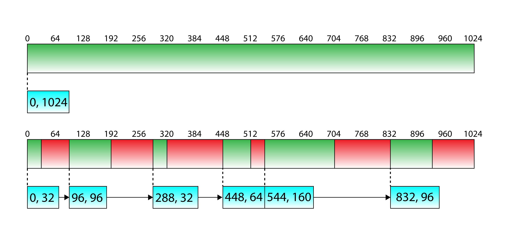

# Descriptor Allocator

`Descriptor Allocator` 分配器用于分配下面的描述符

* **Render Target Views(`RTV`)**
* **Depth Stencil Views(`DSV`)**
* **Constant Buffer View(`CBV`)**
* **Shader Resource Views(`SRV)**
* **Unordered Access Views(`UAV`)**
* **Samples**

`Descriptor Allocator` 类用于在加载新资源(如纹理)时为应用程序分配描述符, 在一个游戏引擎中, 需要偶尔的从内存加载和卸载资源

`Descriptor Allocator` 使用空闲链表来管理所有的描述符. 空闲链表用来追踪可用的空闲列表. 空闲链表的每个条目存储内存中可用的分配.  为了满足分配, 空闲列表必须搜索所有的空闲块, 找到足够大的空间分配给请求, 如果当前 Page 不能满足分配, 那么就会创建一个新的 Page

上图显示了使用空闲列表分配策略分配的内存页示例, 上面的图表示的 Page 未被分配的状态. 在这种情况下, Page 只包含一个引用整个内存页的条目. 

下图暂时了 Page 做出了一些分配后的状态. 分配时会寻找一个条目分配内存, 如果所有的内存都无法满足请求, 那么就添加一个新的 Page 

