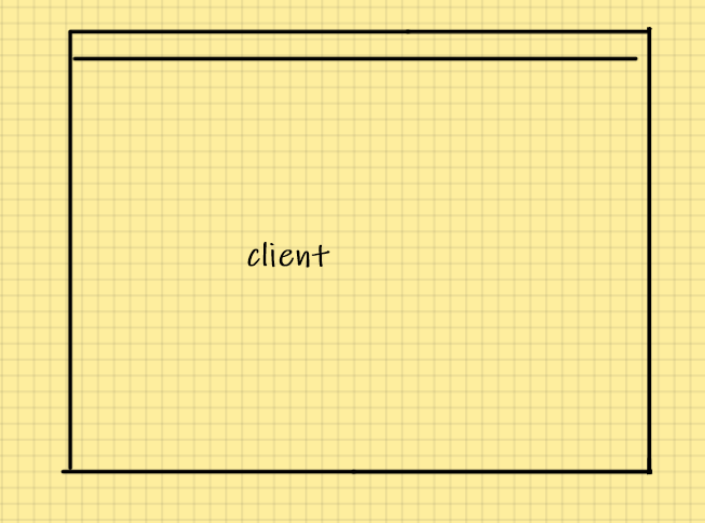

# win 窗口处理

## 窗口初始化

```cc
#include <Windows.h>

LRESULT CALLBACK wndProc(HWND hwnd, UINT msg, WPARAM wParam, LPARAM lParam) {
	switch (msg) {
	case WM_CLOSE:
		PostQuitMessage(69);		// set exit application code
		break;
	}
	return DefWindowProc(hwnd, msg, wParam, lParam);
}

int CALLBACK WinMain(
	_In_ HINSTANCE hInstance,
	_In_opt_ HINSTANCE hPrevInstance,
	_In_ LPSTR lpCmdLine,
	_In_ int nShowCmd
) {
	const char *pClassName = "LearnDirectX12";

	// register class
	WNDCLASSEX wc;
	wc.cbSize = sizeof(wc);
	wc.style = CS_OWNDC;
	wc.lpfnWndProc = wndProc;
	wc.cbClsExtra = 0;
	wc.cbWndExtra = 0;
	wc.hInstance = hInstance;
	wc.hIcon = nullptr;
	wc.hCursor = nullptr;
	wc.hbrBackground = nullptr;
	wc.lpszMenuName = nullptr;
	wc.lpszClassName = pClassName;
	wc.hIconSm = nullptr;
	RegisterClassEx(&wc);

	// create window
	HWND hwnd = CreateWindowEx(	
		0, pClassName, "hello window",	
		WS_CAPTION | WS_MINIMIZEBOX | WS_SYSMENU,
		200, 200,
		640, 480,
		nullptr, nullptr, hInstance, nullptr
	);
	ShowWindow(hwnd, SW_SHOW);

	// handle window message
	MSG msg;
	BOOL result;
	while ((result = GetMessage(&msg, nullptr, 0, 0)) > 0) {
		TranslateMessage(&msg);
		DispatchMessage(&msg);
	}

	if (result == -1)
		return -1;
	else
		return msg.wParam;
}
```

## 键盘输入

当按下键盘按键时, 会触发 `WM_KEYDOWN`, 松开键盘按键时会触发 `WM_KEYUP`. 此时 `wParam` 就是输入的按键(不区分大小写) 查看 [Virtual-Key 代码 (Winuser.h) - Win32 apps | Microsoft Docs](https://docs.microsoft.com/zh-cn/windows/win32/inputdev/virtual-key-codes) 对于每一个按键的宏. 对于字母 `wParam` 就是它们的 `ascii` 码

```cc
switch (msg) {
case WM_KEYDOWN:
        if (wParam == 'W') 
            ...
        if (wParam == 'S')
            ...
        break;
case WM_KEYUP:
        if (wParam == 'A')
            ...
		if (wParam == 'D')
            ...
        break;
}
```

## 文本输入

`WM_KEYDOWN, WM_KEYUP` 是无法处理大小写的. 如果需要文本输入时无法使用. 使用 `WM_CHAR` 来获取大小写输入

> 当按下一个按键时, 是不是触发 `WM_CHAR` 的. `TranslateMessage` 的作用就是将 `WM_KEYDOWN` 转换为 `WM_CHAR`.
>
> 所以按下按键时, 两种消息都会存在

```cc
switch (msg) {
case WM_CHAR:
        if (wParam == 'a')
            ...
        if (wParam == 'A')
        break;
}
```

## `HWND` 和窗口指针绑定

1. 在创建窗口时, `CreateWindowEx` 的最后一个参数可以传递一个用户数据, `CreateData`
2. 在进入 `WM_NCCREATE` 消息时, 可以通过 `lParam` 拿到 `CreateWindowEx` 传递的 `CreateData`
3. 每个 `HWND` 可以通过 `SetWindowLongPtr` 设置窗口的 `GWLP_USERDATA` **user data**

对于一个 win 窗口, 有一个 client 区域的概念, 对应的是 `WM_NCCREATE` 消息码




```cc
// 创建一个 Window 窗口
Window::Window(int width, int height, const std::string &title)
: hwnd_(nullptr), width_(width), height_(height)
, shouldClose_(false), result(-1) {
	RECT wr;
	wr.left = 100;
	wr.right = wr.left + width;
	wr.top = 100;
	wr.bottom = wr.top + height;
	AdjustWindowRect(&wr, WS_CAPTION | WS_MINIMIZEBOX | WS_SYSMENU, FALSE);	// 调整 Client 的大小
	hwnd_ = CreateWindowEx(
		0, WindowClass::getClassName(), title.c_str(),
		WS_CAPTION | WS_MINIMIZEBOX | WS_SYSMENU,
		CW_USEDEFAULT, CW_USEDEFAULT,
		wr.right - wr.left, wr.bottom - wr.top,
		nullptr, nullptr, WindowClass::getInstance(), this		// 在CreateData中传递this
	);

	if (hwnd_ == nullptr) {
		std::cerr << "Failed Create Window" << std::endl;
		return;
	}
	ShowWindow(hwnd_, SW_SHOWDEFAULT);
	shouldClose_ = false;
}

// 在 CreateWindowEx 时, 传递的时 handleMsgSetup 参数.
static LRESULT CALLBACK Window::handleMsgSetup(HWND hwnd, UINT msg, WPARAM wParam, LPARAM lParam) {
	// 第一次进入到 client 时, 会有 WM_NCCREATE 消息
    if (msg == WM_NCCREATE) {
        // 拿到创建时的 Window 的 this 指针
		const CREATESTRUCT *pCreate = reinterpret_cast<const CREATESTRUCT *>(lParam);
		Window *pWindow = static_cast<Window *>(pCreate->lpCreateParams);
        // 把 this 指针设置到 GWLP_USERDATA 里面去
		SetWindowLongPtr(hwnd, GWLP_USERDATA, reinterpret_cast<LONG_PTR>(pWindow));
        // 修改 GWLP_WNDPROC 处理函数为其他版本
		SetWindowLongPtr(hwnd, GWLP_WNDPROC, reinterpret_cast<LONG_PTR>(&handleMsgThunk));
		return pWindow->handleMsg(hwnd, msg, wParam, lParam);
	}
	return DefWindowProc(hwnd, msg, wParam, lParam);
}

static LRESULT CALLBACK Window::handleMsgThunk(HWND hwnd, UINT msg, WPARAM wParam, LPARAM lParam) {
	// 直接从 GWLP_USERDATA 取到 Window 指针
    Window *ptr = reinterpret_cast<Window *>(GetWindowLongPtr(hwnd, GWLP_USERDATA));
	if (ptr != nullptr)
		return ptr->handleMsg(hwnd, msg, wParam, lParam);
	return DefWindowProc(hwnd, msg, wParam, lParam);
}
```

