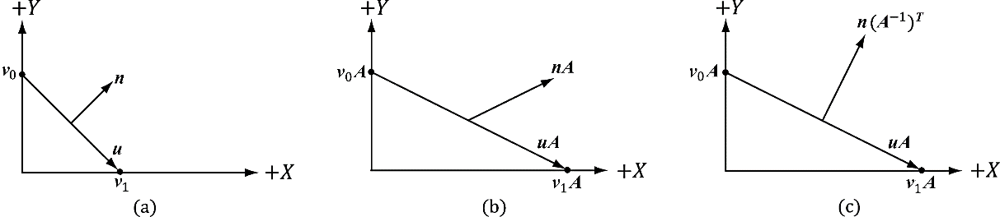
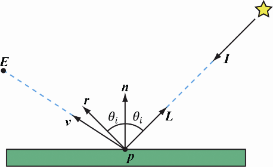

# 光照

## 变换法向量

对变换矩阵先取逆, 在转置

## 参与计算的三个向量

## 漫反射

漫反射采用朗伯余弦定理

$D_I$ **Direct Light Intensity** 直接光照辐射度

$M_A$ **Material Albedo** 反照率
$$
K_d = \max(L \cdot N, 0) \times D_I \times M_A
$$

## 环境光照

不考虑光线的多次弹射. 采用一个常量估算光线多次弹射以后的辐射度

$A_I$ **Ambient Intensity** 环境光照辐射度

$M_A$ **Material Albedo** 反照率
$$
K_a = A_I \times M_A
$$

## 镜面光照

使用半程向量计算反射能量
$$
H = \frac{V + L}{\|V + L\|}\\
K_s = \max(H \cdot N, 0) \times D_I
$$

## 菲涅尔公式

