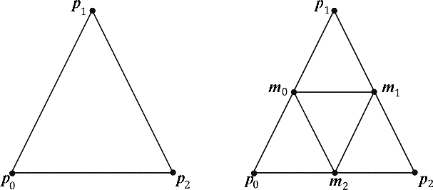
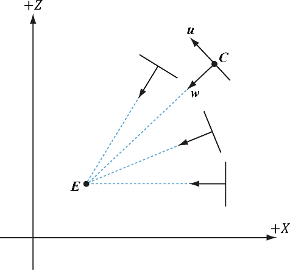
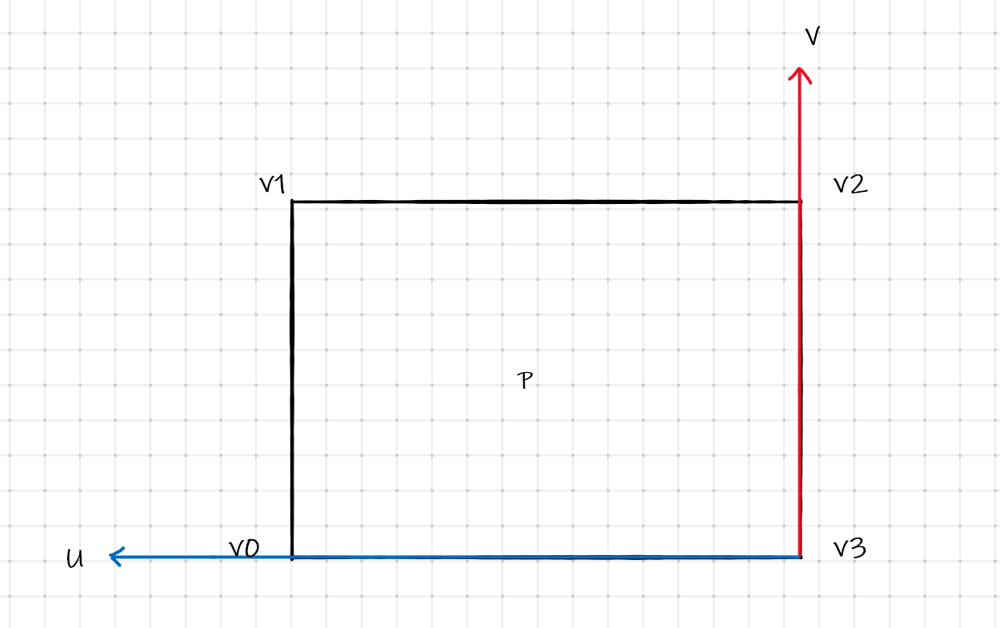

# 几何着色器

##  编写几何着色器

```glsl
[maxvertexcount(N)]	
void GS(
   PrimitiveType InputVertexType inputName[NumElements],	// 输入
   inout StreamOuputObject<OutputVertexType> outputName		// 输出
) 
{
    // 几何着色器的具体实现
}
```

### 指定几何着色器的最大顶点输出

```cc
[maxvertexcount(N)] 
```

其中的 N 是单次调用几何着色器输出的顶点数量的最大值. 虽然每次调用输出的顶点个数都不一样, 但是不能超过定义的大值

出于对性能方面的考量，我们应当令maxvertexcount的值尽可能地小.

> 每次输出的标量数量在1～20时，它将发挥出最佳的性能；
>
> 而当GS每次输出的标量数量保持在27～40时，它的性能将下降到峰值性能的50%;
>
> 标量的计算方式为, **N * 顶点输出的字段数**


### 几何着色器的输入

GS 中的第一个参数, 定义了输入 

```glsl
PrimitiveType VertexOut inputName;		 
```

**`PrimitiveType`**   为图元类型.

| 类型         | 含义           |
| ------------ | -------------- |
| `point`      | 输入的是点类型 |
| `line`       | 输入的是线段   |
| `triangle`   | 输入的是三角形 |
| `lineadj`    | 输入的为线列表 |
| `trangleadj` | 输入的三角形带 |

**注意:**

> 几何着色器输入的数据必须是完整的图元（例如组成线条的两个顶点、构成三角形的3个顶点等）。因此，几何着色器并不会区分输入的图元究竟是列表结构（list）还是带状结构（strip）。举个例子，若绘制的图元实际上是三角形带，但几何着色器仍会把三角形带视作多个三角形并分别进行单独的处理，即将每个三角形的3个顶点作为其输入数据。绘制带状结构的过程中会产生额外的开销，因为多个图元所共用的顶点在几何着色器中会被处理多次

### 几何着色器的输出

GS 中的第二个参数, 定义了输出 

```glsl
inout StreamOuputObject<OutputVertexType> outputName;	// 输出
```

必须使用 `inout` 关键字声明,  另外**它必须是一种流类型(`StreamOuputObject`)**, 流类型存有一系列顶点，它们定义了几何着色器输出的几何图形. 几何着色器可以通过内置方法Append向输出流列表添加单个顶点

```glsl
void StreamOuputObject<OuputVertexType>::Append(OuputVertexType v);
```

流类型本质上是一种模板类型（template type），其模板参数用以指定输出顶点的具体类型（如GeoOut）。流类型有如下3种

| 类型                              | 函数                       |
| --------------------------------- | -------------------------- |
| `PointStream<OuputVertexType>`    | 一系列顶点所定义的点列表   |
| `LineStream<OutputVertexType>`    | 一系列顶点所定义的线条带   |
| `TriangleStream<OuputVertexType>` | 一系列顶点所定义的三角形带 |

**对于线条与三角形来说，几何着色器输出的对应图元必定是线条带与三角形带**, 而线条列表与三角形列表可借助内置函数`RestartStrip` 来实现

```glsl
void StreamOutputObject<OuputVertexType>::RestartStrip();
```

> 例如我们不需要线条带, 而是需要线条时, 每追加两个顶点时, 必须调用一次 `RestartStrip()` 函数
>
> 例如我们需要三角形带, 而是需要三角形列表, 每追加三个顶点时, 必须调用一次 `RestartStrip()` 函数

## 几何着色器三角形细分



通过将同一个三角形划分为三个小三角形, 完成三角形细分

## 公告牌实现森林效果

当树与树之间的距离较远时, 绘有3D树木图片的四边形来替代对整棵3D树的渲染. 远处看去，公告牌技术往往并不会露出破绽。这里还有一个小秘诀，就是使公告牌总是面向摄像机, 仅仅 



通过下面的公式可以轻松算出 $\vec{u}$ 向量
$$
\begin{aligned}
\vec{v} &= \begin{bmatrix}  0 & 1 & 0\end{bmatrix}\\
\vec{w} &= \frac{E - C}{|E-C|}\\
\vec{u} &= w \cross v
\end{aligned}
$$
有了 $\vec{u}\ \vec{v}$ 向量, 就可以通过一个点构建一个朝向相机的面片



四个点的计算方式如下, 在 DX 中, 使用的是左手坐标系

```glsl
uniform float halfWidth;
uniform float halfHeight;
void buildQuad(vec3 u, vec3 v) {
    vec3 hu = halfWidth;
    vec3 hv = halfHeight * v;
    vec3 v0 = p + hu - hv;	// 顶点0
    vec3 v1 = p + hu + hv;	// 顶点1
    vec3 v2 = p - hu + hv;	// 顶点2
    vec3 v3 = p - hu - hv;	// 顶点3
}
```

## 图元ID

`hlsl` 提供几个预设变量, 提供我们访问

```cc
// vertID: 就是顶点的索引值
VertexOut VS(VertexIn vin, uint vertID : SV_VertexID) {
    // 顶点着色器主体
}

// primID, 图元ID, 每个draw对象都会尝试一个ID
[maxvertexcount(4)]
void GS(point VertexOut gin[1], 
       	uint primID : SV_PrimtiveID,
        inout TriangleStream<GeometryOut> triStream) {
    // 几何着色器主体
}

// primID: 图元ID, 如果没有几何着色器, 那么写可以在片段着色器中声明使用
float4 PS(VertexOut pin, uint primID : SV_PrimitiveID) : SV_Target {
    // 片段着色器主体
}
```

## 完整的 billboard 几何着色器

```cc
[maxvertexcount(4)]
void GS(point VertexOut gin[1], 
        uint primID : SV_PrimitiveID, 
        inout TriangleStream<GeometryOut> triStream) 
{
    float3 v = float3(0.0, 1.0, 0.0);
    float3 w = gPass.eyePos - gin[0].position;
    w.y = 0.0;		// 只有 y 方向上平行
    w = normalize(w);
    float3 u = cross(v, w);
    float3 halfU = gin[0].size.x * 0.5 * u;
    float3 halfV = gin[0].size.y * 0.5 * v;
    
    // billboard 每个顶点的位置
    float3 center = gin[0].position;
    float3 vertices[4] = {
        center + halfU - halfV,
        center + halfU + halfV,
        center - halfU - halfV,
        center - halfU + halfV,
    };
    
    // billboard 每个纹理坐标的位置
    const float2 texcoords[4] = {
        float2(0.0, 1.0),
        float2(0.0, 0.0),
        float2(1.0, 1.0),
        float2(1.0, 0.0),
    };

    [unroll(4)]		// 循环展开
    for (int i = 0; i < 4; ++i) {	// 添加4个顶点, 组成三角形带
        GeometryOut vert;
        vert.SVPosition = mul(gPass.viewProj, float4(vertices[i], 1.0));
        vert.position = vertices[i];
        vert.normal   = w;
        vert.texcoord = texcoords[i];
        vert.primID   = primID;
        triStream.Append(vert);
    }
}
```

