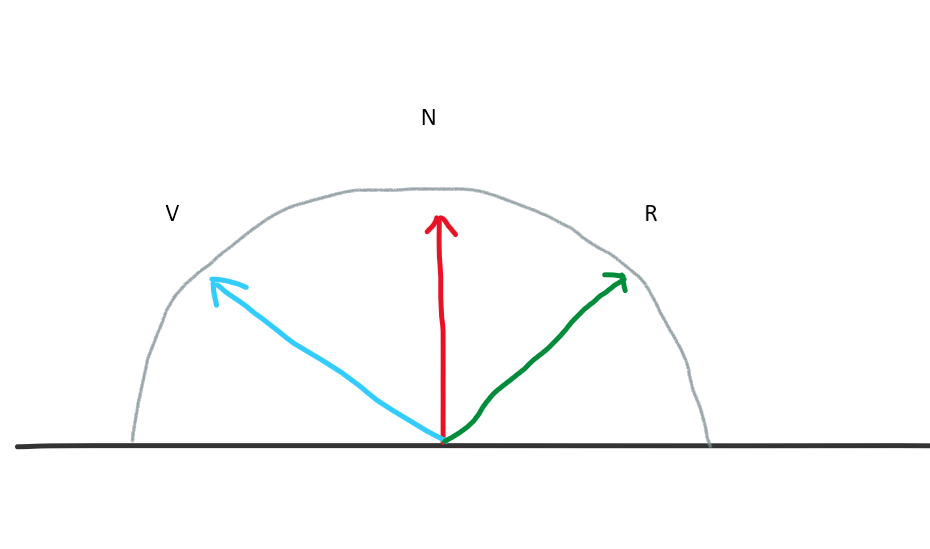
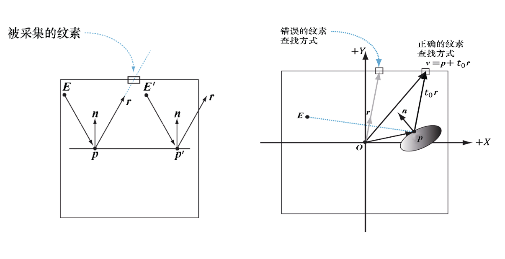
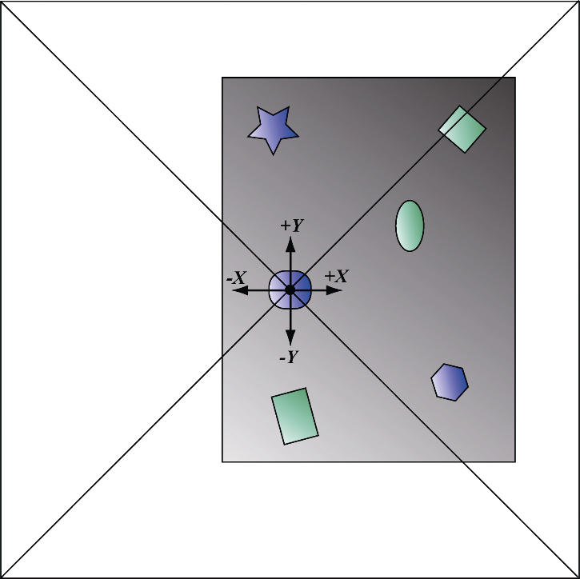

# 立方体贴图

## 什么是立方体贴图

存储6个纹理，将它们分别看作立方体的6个面——因此而得名“立方体图”

在Direct3D中，立方体图被表示为一个由6个元素所构成的纹理数组

1. 索引0援引的是与 `+x` 轴相交的面。
2. 索引1援引的是与 `-x` 轴相交的面。
3. 索引2援引的是与 `+y` 轴相交的面。
4. 索引3援引的是与 `-y` 轴相交的面。
5. 索引4援引的是与 `+z` 轴相交的面。
6. 索引5援引的是与 `-z` 轴相交的面。

在HLSL中，立方体纹理用 `TextureCube` 类型来表示。下列代码片段详尽地展示了对立方体图进行采样的方法

```cc
TextureCube gCubeMap 		: register(t0);
SamplerState gSamLinearWrap : register(s0);

float4 PS(VertexOut pin) : SV_Target {
    float3 v = pin.worldPosition;
    float4 color = gCubeMap.Sample(gSamlinearWrap, v);
}
```

***

## 通过Direct3D加载并使用立方体图

使用 `DDSTextureLoader.h/cpp` 已经支持对立方体贴图得加载

**加载立方体贴图**

```cc
ComPtr<ID3D12Resource> pSkyTex = nullptr;
ComPtr<ID3D12Resource> pUploader = nullptr;
ThrowIfFailed(DirectX::CreateDDSTextureFromFile12(
	_pDevice,
    -pCommandList,
    L"filepath.dds",
    pSkyTex,
    pUploader
));
```

**创建SRV**

为立方体贴图创建 SRV 时, 应该指定为 ` D3D12_SRV_DIMENSION_TEXTURECUBE` 并且使用 `TextureCube` 的属性

```cc
D3D12_SHADER_RESOURCE_VIEW_DESC srvDesc = {};
srvDesc.Shader4ComponentMapping = D3D12_DEFAULT_SHADER_4_COMPONENT_MAPPING;
srvDesc.ViewDimension = D3D12_SRV_DIMENSION_TEXTURECUBE;
srvDesc.TextureCube.MostDetailedMip = 0;
srvDesc.TextureCube.MipLevels = skyTex->GetDesc().MipLevels;
srvDesc.TextureCube.ResourceMinLODClamp = 0.0f;
srvDesc.Format = skyTex->GetDesc().Format;
_pDevice->CreateShaderResourceView(skyTex.Get(), &srvDesc, hDescriptor);
```

***

## 绘制天空纹理

为了保证天空盒的正确性. 需要有一下保证

1. 天空盒永远在最后面, 透视除法后的深度`z`必须为 1.0
2. 永远不会穿过天空盒, 去除 view 矩阵的平移

完整的实现如下:

```cc
struct CBSkyBoxSetting : register(b0) {
  	float4x4 gViewProj;			// view 是没有平移的  
};

struct VertexIn {
  	float3 position : POSITION;  
};

struct VertexOut {
  	float4 SVPosition : SV_Position;
    float3 texcoord   : TEXCOORD;
};

VertexOut VS(VertexIn vin) {
    Vertex vout;
    vout.SVPosition = mul(gViewProj, float4(position, 1.0)).xyww;
    vout.texcoord   = position;
    return vout;
}

TextureCube gCubeMap 		: register(t0);
SamplerState gSamLinearWrap : register(s0);
float4 PS(VertexOut pin) : SV_Target {
    float3 texColor = gCubeMap.Sample(gSamLinearWrap, pin.texcoord).rgb;
    return float4(texColor, 1.0);
}
```

## 模拟反射

对于模拟反射, 我们会简单的使用下面的公式计算出反射向量. 然后去查找天空盒, 但是这样计算处理的结果是不准确的
$$
R = 2N - V
$$


但是这样计算出来的结果是不准确的, 因为没有位置信息, 让任意的位置, 只要 V 相同, 看到的 R 都是一样的

不难发现, 我们在 $E$ 和 $E'$ 处看到的结果是不同的




这种情况下, 我们不能简单的使用 $R$ 来模拟反射. 而是使用射线与包围盒的交点 $v = o + td$ 表示

对于射线和 AABB 的碰撞, 记为 p 分别与 AABB 的三平面做求交
$$
	n \cdot p(t) + d = 0\\
	n \cdot (p_0 + tu) + d = 0\\
	n \cdot p_0 +  tn \cdot u + d = 0\\
	tn \cdot u = -n \cdot p_0 - d\\
	t = \frac{-n \cdot p_0}{n \cdot u}
$$
因为法线分别是 $(1, 0, 0), (0, 1, 0), (0, 0, 1)$ 所以

1. $-p_0 = -n \cdot p _0$ 

2. $u_i = n \cdot u$

```cc
float3 BoxCubeMapLookup(float3 rayOrigin, float3 rayDir, float3 boxCenter, float3 boxExtents) {
    float3 p = rayOrigin - boxCenter;		// 计算出在包围盒内的相对坐标(起点)
    float3 t0 = (-p + boxExtents) / rayDir;
    float3 t1 = (-p - boxExtents) / rayDir;
    float3 tmax = max(t0, t1);						// 获得每个平面上的远交点
    float t = min(min(tmax.x, tmax.y), tmax.z);		// 最先相交的平面就是交点
    return p + t * rayDir;
}
```

***

## 动态立方体贴图

为了运行时动态的构建立方体贴图

每一帧都要将摄像机置于场景之内，以它作为立方体图的原点，沿着坐标轴共6个方向将场景分六次逐个渲染到立方体图的对应面上



## 构建立方体贴图资源

通过创建具有6个元素的纹理数组, 每个元素对应立方体的某一个面

```cc
void CubeRenderTarget::buildCubeResource() {
    D3D12_RESOURCE_DESC texDesc;
	memset(&tesDesc, 0, sizeof(D3D12_RESOURCE_DESC));
    texDesc.Dimemsion = D3D12_RESOURCE_DIMEMSION_TEXTURE_2D;
    texDesc.Alignment = 0;
    texDesc.Width = _width;
    texDesc.Height = _height;
    texDesc.DepthOrArraySize = 6;		// 这里设置为 6 表示立方体的 6 个面
    texDesc.MipLevels = 1;				// 我们之只需要一个 mipmap. 如果是做 IBL 的 specual 时, 可以根据需要获取
    texDesc.Format = _format;			
    texDesc.SampleDesc.Count = 1;
    texDesc.SampleDesc.Quality = 0;
    texDesc.Layout = D3D12_TEXTURE_LAYOUT_UNKNOW;
    texDesc.Flags = D3D12_RESOURCE_FLOA_ALLOW_RENDER_TARGET;
    
    ThrowIfFailed(_pDevice->CreateCommitedResource(
 		RVPtr(CD3DX12_HEAP_PROPERITES(D3D12_HEAP_TYPE_DEFAULT)),
        D3D12_HEAP_FLAG_NONE,
        &texDesc,
        D3D12_RESOURCE_STATE_GENERIC_READ,
        nullptr,
        IID_PPV_ARGS(_pCub)
    ));
}
```

