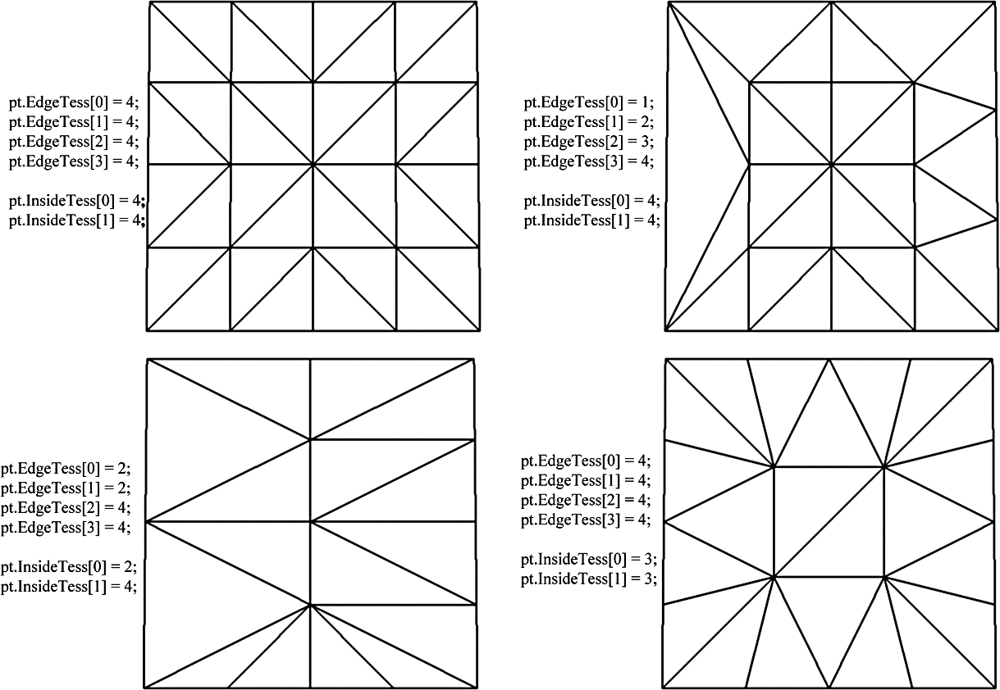
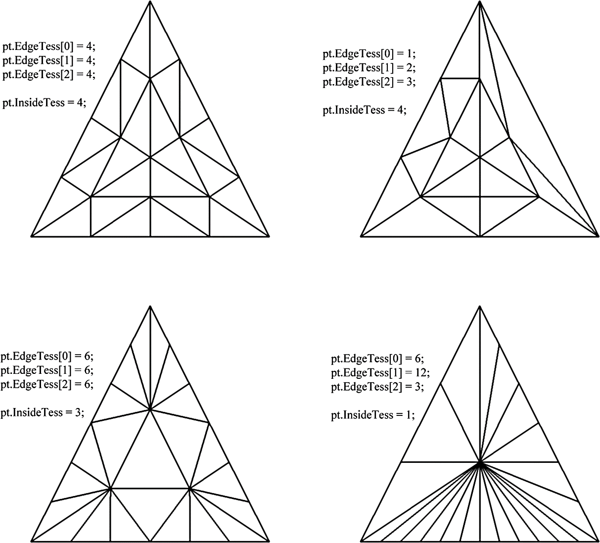
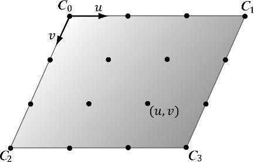

# 曲面细分阶段

以下是使用曲面细分的3个理由

1. 基于GPU实现动态LOD
2. 物理模拟与动画特效. 我们可以在低模网格上执行物理模拟与动画特效的相关计算, 再以镶嵌化处理手段来获取细节更加丰富的网格
3. 节约内存。我们可以在各种存储器（磁盘、RAM与VRAM）中保存低模网格，再根据需求用GPU动态地对网格进行镶嵌细分

**曲面细分位于顶点着色器与几何着色器之间**


***

## 如何使用曲面细分

1. PSO 中的 `PrimitiveTopologyType` 配置为 `D3D12_PRIMITIVE_TOPOLOGY_TYPE_PATCH` 模式
2. `commandList` 的图元类型需要使用为 **曲面细分的图元类型**

## 曲面细分的图元类型

在进行曲面细分时，我们并不向IA输入装配阶段提交三角形, 而是提交具有若干控制点的面片. 

Direct3D支持具有1～32个控制点的面片，并以下列图元类型进行描述

```cc
D3D_PRIMITIVE_TOPOLOGY_1_CONTROL_POINT_PATCHLIST = 33,
D3D_PRIMITIVE_TOPOLOGY_2_CONTROL_POINT_PATCHLIST = 34,
D3D_PRIMITIVE_TOPOLOGY_3_CONTROL_POINT_PATCHLIST = 35,
D3D_PRIMITIVE_TOPOLOGY_4_CONTROL_POINT_PATCHLIST = 36,
.
.
.
D3D_PRIMITIVE_TOPOLOGY_31_CONTROL_POINT_PATCHLIST = 63,
D3D_PRIMITIVE_TOPOLOGY_32_CONTROL_POINT_PATCHLIST = 64,
```

可以将三角形看作是拥有3个控制点面片 `D3D_PRIMITIVE_3_CONTROL_POINT_PATCH`, 

可以提交需要镶嵌化处理的普通三角形网格, 对于简单的四边形面片而言, 则只需提交具有 4 个控制点的面片 `D3D_PRIMITIVE_4_CONTROL_POINT_PATCH` 即可. 这些面片最终会曲面细分阶段为多个三角形

***

## 曲面细分与顶点着色器

**在开启曲面细分之时，顶点着色器就彻底沦陷为“处理控制点的着色器”**

### 外壳着色器

在以下小节中，我们会探索外壳着色器, 它实际上是由两种着色器组成的

1. 常量外壳着色器。
2. 控制点外壳着色器

#### 常量外壳着色器

常量外壳着色器, 每个面片处理一次, 它的任务是输出网格的**曲面细分因子**

曲面细分因子指示了在曲面细分阶段中将面片镶嵌处理后的份数

下面是一个具有4个控制点的四边形面片示例，我们将它从各个方面均匀地镶嵌细分为3份

```cc
struct PatchTess {
    float EdgeTess[4]   : SV_TessFactor;
    float insideTess[2] : SV_InsideTessFactor;
};

PatchTess ConstantHS(InputPatch<VertexOut, 4> patch, 
                     uint patchID : SV_PrimitiveID) 
{
    PatchTess pt;
    pt.EdgeTess[0] = 3;	// 四边形面片的左侧
    pt.EdgeTess[1] = 3;	// 四边形面片的上侧
    pt.EdgeTess[2] = 3;	// 四边形面片的右侧
    pt.EdgeTess[3] = 3; // 四边形面片的下侧
	
    pt.InsideTess[0] = 3;	// u 轴(四边形内部细分的列数)
    pt.InsideTess[1] = 3;	// v 轴(四边形内部细分的行数)
    return pt;
}
```

常量外壳着色器以面片的所有控制点作为输入，用 `InputPatch<VertexOut, 4>` 对此进行定义. 在此例中，我们的面片拥有4个控制点，所以就将 `InputPatch` 模板的第二个参数指定为 4.

系统还通过 `SV_PrimitiveID` 语义提供了面片的ID值，此ID唯一地标识了绘制调用过程中的各个面

**对四边形面片进行镶嵌化处理的过程由两个部分构成**

1. 4个边缘曲面细分因子控制着对应边缘镶嵌后的份数
2. 两个内部曲面细分因子指示了如何来对该四边形面片的内部进行镶嵌化处理

**对三角形面片（triangle patch）执行镶嵌化处理的过程同样分为两部分：**

	1. 3个边缘曲面细分因子控制着对应边上镶嵌后的份数
	2. 一个内部曲面细分因子指示着三角形面片内部的镶嵌份数

***

**`Direct3D11` 硬件所支持的最大曲面细分因子为 `64`. 如果曲面细分因子为 0, 则面片会被丢弃, 这意味着可以做剔除优化**

1. 面片没有在视锥体内，从后续的处理中丢弃
2. 面片是背面朝向的，从后面的处理中丢弃

***

**以下是一些确定镶嵌次数的常用衡量标准:**

1. **根据与摄像机之间的距离**：物体与摄像机的距离越远，能分辨的细节就越少
2. **根据占用屏幕的范围：**可以先估算出物体覆盖屏幕的像素个数。如果数量比较少，则渲染物体的低模版本
3. **根据三角形的朝向**：三角形相对于观察者的朝向. 位于物体轮廓边缘上的三角形比其他位置的三角形更多面数
4. **根据粗糙程度：**粗糙不平的表面需要更细致的曲面细分处理. 

***

**给出了以下几点关于性能的建议:**

1. 如果曲面细分因子为1, 那么就考虑在渲染此面片时不对它进行细分处理；否则，便会在曲面细分阶段白白浪费GPU资源，因为在此阶段并不对其执行任何操作
2. 考虑到性能又涉及GPU对曲面细分的具体实现，所以不要对小于8个像素这种过小的三角形进行镶嵌化处理
3. 使用曲面细分技术时要采用批绘制调用, 绘制调用之间往复开启、关闭曲面细分功能的代价极其高昂

***

#### 控制点外壳着色器

以大量的控制点作为输入与输出，每输出一个控制点，此着色器都会被调用一次. 

该外壳着色器的应用之一是改变曲面的表示，把一个普通的三角形转换为3次贝塞尔三角形面片

**控制点外壳着色器示例:**

```cc
struct HullOut {
  	float PosL : POSITION;  
};

[domain("quad")]
[partitioning("integer")]
[outputtopology("triangle_cw")]
[outputcontrolpoints(4)]
[patchconstantfunc("ConstantHS")]
[maxtessfactor(64.0f)]
HullOut HS(InputPatch<VertexOut, 4> p, 
           uint i : SV_OutputControlPointID,
           uint patchID : SV_PrimitiveID )
{
    HullOut hout;
    hout.PosL = p[i].PosL;
    return hout;
}
```

| 函数名                  | 作用                                                         |
| ----------------------- | ------------------------------------------------------------ |
| **domain**              | 面片的类型. 可选用的参数有 `tri` **三角形面片**、`quad`**四边形面片**或 **`isoline`等值线** |
| **partitioning**        | 指定了曲面细分的细分模式: <br />1. `integer`: 新顶点的添加或移除仅取决于曲面细分因子的整数部分<br />2. `fractional_even/fractional_odd`: 新顶点的添加或移除取决于曲面细分因子的整数部分，<br />    但是细微的渐变“过渡”调整就要根据因子的小数部分 |
| **outputtopology**      | `outputtopology`：通过细分所创的三角形的绕序: <br />1．`triangle_cw`：顺时针方向的绕序<br />2．`triangle_ccw`：逆时针方向的绕序<br />3.   `line`：针对线段曲面细分 |
| **outputcontrolpoints** | 外壳着色器执行的次数，每次执行都输出n个控制点. <br />系统值 `SV_OutputControlPointID` 给出的索引标明了当前正在工作的外壳着色器所输出的控制点 |
| **patchconstantfunc**   | 指定常量外壳着色器函数名称的字符串                           |
| **maxtessfactor**       | 告知驱动程序，用户在着色器中所用的曲面细分因子的最大值, 方便硬件优化 |

***

### 镶嵌器阶段

程序员无法对镶嵌器控制，这一步骤的操作由硬件处理.  镶嵌器会基于常量外壳着色器程序所输出的曲面细分因子，对面片进行镶嵌化处理

**四边形面片的曲面细分示例**



**三角形面片的曲面细分示例**



***

### 域着色器

镶嵌器输出所有顶点与三角形, 都会逐一调用域着色器进行后续处理. 开启曲面细分以后, **顶点着色处理控制点, 域着色器处理原来顶点着色器的工作, 在域着色器中计算好投影坐标**

对于四边形面片来讲，域着色器以曲面细分因子. 控制点外壳着色器所输出的面片控制点

镶嵌化处理后的顶点位置参数坐标 (u, v) 作为输入



有了参数坐标后, 可以通过插值获得新的顶点位置

```cc
struct DomainOut {
  	float4 PosH : SV_Position;  
};

[domain("quad")]
DomainOut DS(PatchTess patchTess, 
             float uv : SV_DomainLocation,		// uv坐标
             const OutputPatch<HullOut, 4> quad)
{
    DomainOut dout;
    float3 v1 = lerp(quad[0].PosL, quad[1].PosL, uv.x);
    float3 v2 = lerp(quad[2].PosL, quad[3].PosL, uv.x);
    float3 p  = lerap(v1, v2, uv.y);
    
    float4 posW = mul(gWorld, float4(p, 1.0));
    dout.PosH = mul(gViewProj, posW);
    return dout;
}
```

**着色器处理三角形面片的方法与处理四边形面片的方法很相似，只是把顶点用类型为 `float3` 的重心坐标**

