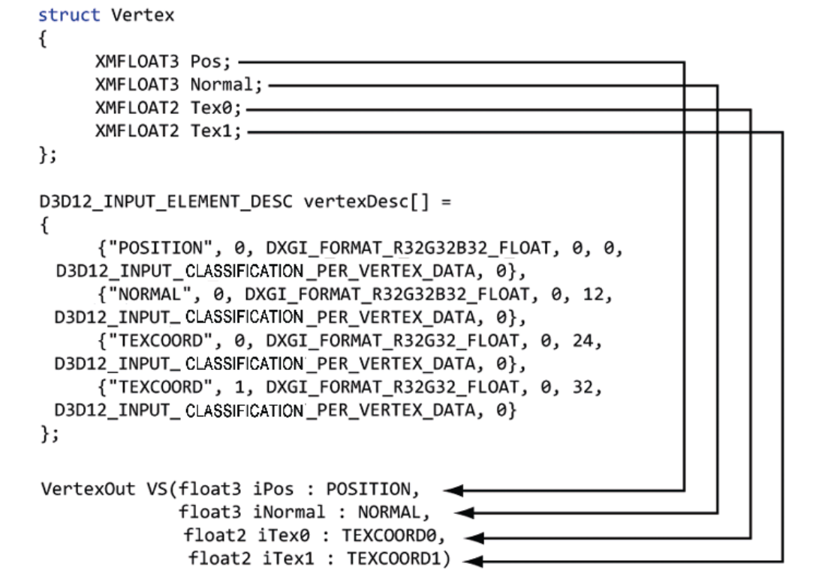

# 着色器

## 输入布局描述

对于顶点着色器的输入. 需要提供描述给 d3d. 

```cc

/*
 * @SemanticName:			语义名,对于顶点着色器
 * @SemanticIndex:			语义附加的索引
 * @Format:					顶点元素的数据类型格式
 * @InputSlot:				输入槽, 目前传递0
 * @AlignedByteOffset:		字段在顶点中的偏移量
 * @InputSlotClass:			实例化使用. 现阶段
 * 							暂时传递 D3D12_INPUT_CLASSIFICATION_PER_INSTANCE_DATA
 * @InstanceDataStepRate:	不使用实例化传递0,使用实例化传递1
 */
typedef struct D3D12_INPUT_ELEMENT_DESC {
    LPCSTR						SemanticName;
    UINT 						SemanticIndex;
    DXGI_FORAMT					Format;
    UINT 						InputSlot;
    UINT						AlignedByteOffset;
    D3D12_INPUT_CLASSIFICATION 	InputSlotClass;
    UINT						InstanceDataStepRate;
} D3D12_INPUT_ELEMENT_DESC;

/* 
 * @pInputElementDesc:		顶点布局描述数组指针
 * @NumElements:			数组个数
 */
typedef struct D3D12_INPUT_LAYOUT_DESC {
  	const D3D12_INPUT_ELEMENT_DESC  	*pInputElementDesc;
    UINT								 NumElements;
} D3D12_INPUT_LAYOUT_DESC;
```

**布局示例**




## 顶点着色示例

**版本1**

```hlsl
cbuffer cbPerObject : register(b0) {		// uniform
	float4x4	gWorldViewProj;
};

// vertex shader argsument
void VS(in  float3 	iPosL 	: POSITION,
		in  float4 	iColor 	: COLOR,
		out float4	oPosH   : SV_POSITION,
		out float4  oColor  : COLOR
) {
	oPosH = mul(float4(iPosL, 1.0f), gWorldViewProj);
	oColor = iColor;
}
```

**版本2**

```hlsl
cbuffer cbPerObject : register(b0) {		// uniform 
	float4x4	gWorldViewProj;
};

struct VertexIn {
	float3	PosL 	: POSITION;
	float4	Clolor	: COLOR;
};

struct VertexOut {
	float4 PosH 	: SV_POSITION;
	float4 Color	: COLOR;
};

void VS(VertexIn vin) {
	VertexVout vout;
	vout.PosH  = mul(float4(vin.PosL, 1.0f), gWorldViewProj);
	vout.Color = vin.Color;
	return vout;
}
```

对应的布局描述

```cc
struct Vertex {
    XMFLOAT3	position;
    XMFLOAT4	color;
};

D3D12_INPUT_ELEMENTS_DESC inputLayouts[] = {
    { 
      	"POSITION", 0, DXGI_FORMAT_R32G32B32_FLOAT, 0, offsetof(Vertex, position), 
      	D3D12_INPUT_CLASSIFICATION_PE_INSTANCE_DATA, 0,
    },
    {
      	"COLOR", 0, DIGI_FORMAT_R32G32B32A32_FLOAT, 0, offsetof(Vertex, color),
        D3D12_INPUT_CLASSIFICATION_PE_INSTANCE_DATA, 0,
    }    
};
```

 ## 根签名和描述符表

定义:

> 在绘制命令之前, 应用程序将绑定到渲染流水线上的资源, 它们会被映射到着色器对应的输入寄存器上. 

在 `Direct3D` 中, 根前面有 `ID3D12RootSignature` 接口表示, 并以一组**根参数**定义而成.

根参数可以是下面的类型

* `root constant` 根常量
* `root descriptor` 根描述符
* `descriptor table` 描述符表: 描述符堆中存有描述符的一块连续内存

下面的代码创建一个根签名. 它的根参数为一个描述符表

```cc
CD3DX12_ROOT_PARAMENTER slotRootParameter[1];

// 创建一个只有 CBV 的描述符表
CD3DX12_DESCRIPTOR_RANGE cbvTable;
cvbTalbe.Init(
	D3D12_DESCRIPTOR_RANGE_TYPE_CBV,		// CBV 类型
    1,										// 1描述数量
    0										// 绑定到 b0 寄存器
);

slotRootParameter[0].InitAsDescriptorTalbe(1, &cbvTable);

// 根签名又一组根参数组成
CD3DX12_ROOT_SIGNATURE_DESC rootSigDes = { 
    1, slotRootParameter, 0, nullptr,
    D3D12_ROOT_SINGATURE_FLAG_ALLOW_INPUT_ASSEMBLER_INPUT_LAYOUT
};

ComPtr<ID3DBlob> serizlizedRootSig = nullptr;
ComPtr<ID3DBlob> errorBlob = nullptr;
HRESULT hr = D3D12SerizlizeRootSignature(
    &rootSigDesc,
    D3D_ROOT_SIGNATURE_VERTSION_1,
    &serizlizedRootSig,
    &errorBlob
);
if (FAILED(hr)) {
		OutputDebugStringA((const char *)errorBlob->GetBufferPointer());
		ThrowIfFailed(hr);
}

ThrowIfFailed(d3dDevice_->CreateRootSignature(
    0, 
    serizlizedRootSig->GetBufferPointer(),
    serizlizedRootSig->GetBufferSize(),
    IID_PPV_ARGS(rootSignature_)
));
```

## 描述符表绑定到流水线

```cc
void ID3D12GraphicsList::SetGraphicsRootDescriptorTable(
	UINT 						RootParameterIndex,	// 寄存器
    D3D12_GPU_DESCRIPTOR_HANDLE BaseDescriptor		// 根前面第一个描述符句柄
);
```

**调用示例**

```cc
// 设置签名到流水线
commandList_->SetGraphicsRootSignature(rootSingnature_.Get());
// 设置 CBV 堆到流水线
ID3D12DescriptorHeap *descriptorHeaps[] = { cbvHeap_.Get() };
commandList_->SetDescriptorHeaps(size(descriptorHeaps), descriptorHeaps);
// 绑定描述符表到流水线
CD3DX12_GPU_DESCRIPTOR_HANDLE cbv(cbvHeap_->GetGPUDescriptorHandleForHeapStart());
cbv.Offset(cbvIndex, cbvSrvUavDescriptorSize_);
commandList_->SetGraphicsRootDescriptorTable(0, cbv);
```

## 编译着色器

编译着色有两种方式:

1. 运行时编译
2. 离线时编译

### 运行时编译

```cc
/*
 * @pFileName:		以.hlsl扩展名的着色器文件
 * @pDefines:		暂时不使用,传递nullptr
 * @pInclude:		暂时不是用,传递nullptr
 * @pEntryPoint:	着色器入口函数点.一个hlsl文件可能有多个着色器程序(顶点着色器,像素着色器)
 * @pTarget:		着色器类型和版本号
 -					vs_5_0 和 vs_5_1 表示 5.0 和 5.1 版本的顶点着色器
 -					hs_5_0 和 hs_5_1 表示 5.0 和 5.1 版本的外壳着色器
 -					ds_5_0 和 ds_5_1 表示 5.0 和 5.1 版本的域着色器
 -					gs_5_0 和 gs_5_1 表示 5.0 和 5.1 版本的几何着色器
 - 					ps_5_0 和 ps_5_1 表示 5.0 和 5.1 版本的像素着色器
 - 					cs_5_0 和 cs_5_1 表示 5.0 和 5.1 版本的计算着色器
 * @Flags1:			指示对着色器代码应当如何编译的标志
 -					D3DCOMPILE_DEBUG：用调试模式来编译着色器
 -					D3DCOMPILE_SKIP_OPTIMIZATION：指示编译器跳过优化阶段(对调试很有用处)
 * @Flags2:			不使用
 * @ppCode:			返回一个指向ID3DBlob数据结构的指针,它存储着编译好的着色器对象字节码
 * @ppErrorMsgs:	返回一个指向ID3DBlob数据结构的指针,保存编译错误信息
 */
HRESULT D3DCompileFromFile(
	LPCWSTR 				 pFileName,		
    const D3D_SHADER_MACRO	*pDefines,		
    ID3DInclude 			*pInclude,		
    LPCSTR					 pEntrypoint,	
    LPCSTR 					 pTarget,		
    UINT					 Flags1,		
    UINT					 Flags2,
    ID3DBlob			   **ppCode,
    ID3DBlob			   **ppErrorMsgs
);
```

**关于ID3DBlob**

`ID3DBlob ` 指向一个内存块. 提供了下面的方法

```cc
LPVOID GetBufferPointer();		// 获取缓冲区的指针
SIZE_T GetBufferSize();			// 获取缓冲区的字节大小
```

### 编译着色器辅助函数

```cc
ComPtr<ID3DBlob> CompileShader(
	const std::wstring 		&fileName,
    const D3D_SHADER_MACRO  *defines,
    const std::string 	 	&entryPoint,
    const std::string 		&target) 
{
	UINT compileFlags = 0;
#if defined(DEBUG) || defined(_DEBUG)	// 调试模式,对着色器开启调试
    compileFlags = D3DCOMPILE_DEBUG | D3DCOMPILE_SKIP_OPTIMIZATION;
#endif
    
    HRESULT hr = S_OK;
    ComPtr<ID3DBlob> byteCode = nullptr;
    ComPtr<ID3DBlob> errors = nullptr;
    hr = D3DCompileFromFile(
        filename.c_str(), 
        defines, 
        D3D_COMPILE_STANDARD_FILE_INCLUDE, 
        entrypoint.c_str(),
        target.c_str(),
        compileFlags,
        0,
        &byteCode,
        &errors
    );
    
    // 有错误信息则输出
    if (errors != nullptr)
        OutputDebugStringA((char *)errors->GetBufferPointer());
    
    ThrowIfFailed(hr);
    return byteCode;
}
```

**调用示例**

```cc
ComPtr<ID3DBlob> vsByteCode = nullptr;
ComPtr<ID3DBlob> psByteCode = nullptr;
vsByteCode = CompileShader(L"Shaders/color.hlsl", nullptr, "VS", "vs_5_0");
psByteCode = CompileShader(L"Shaders/color.hlsl", nullptr, "PS", "ps_5_0");
```

### 离线编译

使用离线编译的原因:

1. 对于复杂的着色器来,其编译过程可能耗时较长.

2. 以便在早于运行时的构建处理期间提前发现编译错误。

3. 对于Windows 8应用商店中的应用而言，必须采用离线编译这种方式。

可以是用 `DirectX` 的 `FXC` 命令行编译工具

```shell
fxc filename arguments... 
```

| 选项           | 作用                           |
| -------------- | ------------------------------ |
| `/Od`          | 禁用优化                       |
| `/Zi`          | 开启调试信息                   |
| `/T <string>`  | 着色器模型和着色器版本         |
| `/E <string>`  | 着色器入口                     |
| `/Fo <string>` | 经过编译的着色器对象字节码     |
| `/Fc <string>` | 输出一个着色器汇编代码文件清单 |

## 光栅化状态

下面的结构体用来配置渲染流水线中的光栅化状态

```cc
typedef struct D3D12_RESTERIZER_DESC {
	D3D12_FILL_MODE                       FillMode; // 默认值为 D3D12_FILL_MODE_SOLID
  	D3D12_CULL_MODE                       CullMode;	// 默认值为 D3D12_CULL_MODE_BACK
  	BOOL                                  FrontCounterClockwise; // 默认值为 false
  	INT                                   DepthBias; // 默认值为 0
  	FLOAT                                 DepthBiasClamp; // 默认值为 0.0f
  	FLOAT                                 SlopeScaledDepthBias; // 默认值为 0.0f
  	BOOL                                  DepthClipEnable; // 默认值为 ture
  	BOOL                                  MultisampleEnable; // 默认值为 false
  	BOOL                                  AntialiasedLineEnable; // 默认值为 false
  	UINT                                  ForcedSampleCount; // 默认值为 0
    
    // 默认值为 D3D12_CONSERVATIVE_RASTERIZATION_MODE
  	D3D12_CONSERVATIVE_RASTERIZATION_MODE ConservativeRaster; 
} D3D12_RESTERIZER_DESC;
```

我们只关注下面几点

| 字段                    | 含义                                                         |
| ----------------------- | ------------------------------------------------------------ |
| `FillMode`              | `D3D12_FILL_MODE_WIREFRAME` 线框模式<br />`D3D12_FILL_MODE_SOLID` 实体模式 |
| `CullMode`              | `D3D12_CULL_MODE_NONE` 禁用剔除<br />`D3D12_CULL_MODE_FRONT` 正面剔除<br />`D3D12_CULL_MODE_BACK` 背面剔除 |
| `FrontCounterClockwise` | 顺时针环绕的三角形表示正面. 逆时针环绕的三角形表示反面       |

## 流水线状态对象

将所需要的数据打包. 类似于 OpenGL 的 VAO.

```cc
typedef struct D3D12_GRAPHICS_PIPLINE_STATE_DESC {
	ID3D12RootSignature			   *pRootSignature;
    D3D12_SHADER_BYTECODE	 		VS;
    D3D12_SHADER_BYTECODE	 		PS;
    D3D12_SHADER_BYTECODE 	 		DS;
    D3D12_SHADER_BYTECODE 	 		HS;
    D3D12_SHADER_BYTECODE 	 		GS;
    D3D12_STREAM_OUTPUT_DESC 		StreamOutput;
    D3D12_BLEND_DESC		 		BlendState;
    UINT					 		SampleMask;
    D3D12_RESTERIZE_DESC 	 		RasterizerState;
    D3D12_DEPTH_STENCIL_DESC 		DepthStencilDesc;
    D3D12_INPUT_LAYOUT_DESC	 		InputLayout;
    D3D12_PRIMITIVE_TOPOLOGY_TYPE 	PrimitiveToyogy;
    UINT							NumRenderTargets;
    DXGI_FORMAT						RTVFormats[8];
    DXGI_FORMAT						DSVFormats[8];
    DXGI__SAMPLE_DESC				SampleDesc;
} D3D12_GRAPHICS_PIPLINE_STATE_DESC;

typedef struct D3D12_SHADER_BYTECODE {
  	const void 	*pShaderBytecode;	// 着色器代码缓冲区
    SUZE_T		 BytecodeLength;	// 长度
} D3D12_SHADER_BYTECODE;
```

| 字段                    | 含义                                                         |
| ----------------------- | ------------------------------------------------------------ |
| `pRootSignature`        | 根签名指针                                                   |
| `VS`                    | 顶点着色器                                                   |
| `PS`                    | 像素着色器                                                   |
| `DS`                    | 域着色器                                                     |
| `HS`                    | 外壳着色器                                                   |
| `GS`                    | 几何着色器                                                   |
| `StreamOutput`          | 流输出. 暂时清零                                             |
| `BlendState`            | 混合状态. 暂时使用 `CD3DX12_BLEND_DESC`                      |
| `SampleMask`            | 多重采样最高有 32 采样. 如果禁用第5个样本. 则第5位设置为 0.<br />默认使用 `0xffffffff` |
| `RasterizerState`       | 配置光栅化的状态                                             |
| `DepthStencilState`     | 指定深度模板状态. 目前设置为默认值 `CD3DX12_DEPTH_STENCIL_DESC` |
| `InputLayout`           | 输入布局描述                                                 |
| `PrimitiveTopologyType` | 指定图元的拓扑类型                                           |
| `NumRenderTargets`      | 同时所用的渲染目标数量                                       |
| `RTVFormats`            | 渲染目标格式(类似 OpenGL 的多渲染返回值)                     |
| `DSVFormat`             | 深度/模板缓冲区的格式                                        |
| `SampleDesc`            | 采样数量, 以及采样等级                                       |

### 创建流水线对象

```cc
HRESULT CreateGraphicsPipelineState(
  const D3D12_GRAPHICS_PIPELINE_STATE_DESC  *pDesc,
  REFIID                                     riid,
  void                                     **ppPipelineState
);
```

**Note:**

> 由于 PSO 的严重和创建过于耗时, 应该在初始化期间就生成 PSO. 除非有特殊情况, 在第一引用时初始化. 并存储在哈希表中, 在后续的过程中能快速获取

### 使用流水线对象

```cc
commandList_->Reset(directCmdListAlloc_.Get(), PSO1.Get());
// 使用 PSO1 绘制物体
commandList_->SetPipelineState(PSO2.Get());
// 使用 PSO2 绘制物体 .
```

