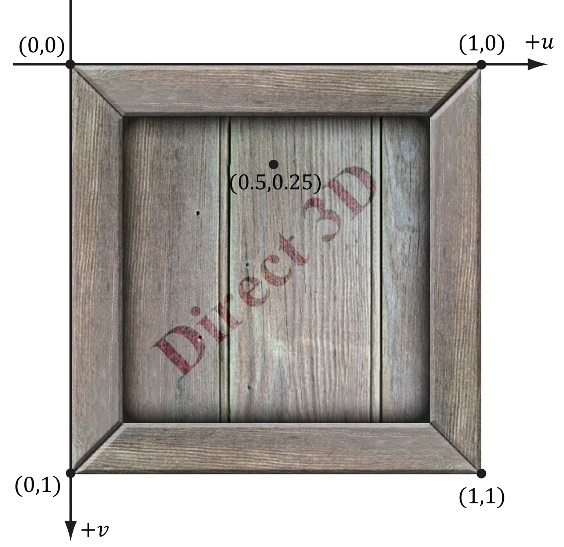

# 纹理映射

## 纹理与资源回顾

区分纹理与资源的是 `D3D12_RESOURCE_DESC::Dimesion` 字段.

下面是常见的纹理格式:

| 类型                             | 描述                                                         |
| -------------------------------- | ------------------------------------------------------------ |
| `DXGI_FORMAT_R16B16G16A16_UNORM` | 每个元素由4个16位浮点数组成,每个分量都被映射到 [0, 1] 之间   |
| `DXGI_FORMAT_R32G32B32_FLOAT`    | 每个元素由 3 个 32 位的浮点数组成                            |
| `DXGI_FORMAT_R32G32_UINT`        | 每个元素由 2 个 32 位无符号整数构成                          |
| `DXGI_FORMAT_R8G8B8A8_UNORM`     | 每个元素由 4 个 8 位无符号分量构成, 每个分量都被映射到 [0, 1] 之间 |
| `DXGI_FORMAT_R8G8B8A8_SNORM`     | 每个元素由4个8位有符号分量构成，每个分量都将被映射到范围[-1, 1]之间 |
| `DXGI_FORMAT_R8G8B8A8_SINT`      | 每个元素由4个8位有符号整数分量构成，每个分量都将被映射到范围[-128, 127]之间 |
| `DXGI_FORMAT_R8G8B8A8_UINT`      | 每个元素由4个8位无符号整数分量构成，每个分量都将被映射到范围[0, 255]之间 |
| `DXGI_FORMAT_R8G8B8A8_TYPELESS`  | 无类型的数据, 只是预留了空间, 在绑定流水线的时候, 指定其中的数据格式 |

## 纹理的使用方式

纹理有两种使用方式: 

1. 渲染到纹理
2. 着色器资源采样

```cc
// 渲染到纹理
CD3DX12_CPU_DESCRIPTOR_HANDLE rtv = ...;
CD3DX12_CPU_DESCRIPTOR_HANDLE dsv = ...;
pCommandList_->OMSetRenderTarget(1, &rtv, true, &dsv);

// 将纹理作为输入
CD3DX12_GPU_DESCRIPTOR_HANDLE tex = ...;
pCommandList_->SetGraphicsRootDescriptorTable(rootParamIndex, tex);
```

## 纹理空间



DX 使用的纹理坐标如上所示, **左上角是(0, 0), 右下角是(1, 1)**. 这点与 OpenGL 有所不同

## DDS 格式

DDS 满足 3D 图形开发的一下特征

* **mipmap**
* **GPU 能自行解压**
* **纹理数组**
* **立方体图**
* **体纹理**

DDS **非压缩图形数据**一般会采用下列格式

| 类型                             | 作用             |
| -------------------------------- | ---------------- |
| `DXGI_FORMAT_B8G8R8A8_UNORM`     | 适用于低动态范围 |
| `DXGI_FORMAT_B8G8R8X8_UNORM`     | 适用于低动态范围 |
| `DXGI_FORMAT_R16G16B16A16_FLOAT` | 适用于高动态范围 |

**Direct3D 支持的 DDS 压缩纹理格式**

| 类型                         | 作用                                                         |
| ---------------------------- | ------------------------------------------------------------ |
| `BC1(DXGI_FORMAT_BC1_UNORM)` | 图片压缩为支持 3 个颜色通道和仅有 1 位(开/关) `alpha` 分量的格式 |
| `BC2(DXGI_FORMAT_BC2_UNORM)` | 图片压缩为支持 3 个颜色通道和仅有 4 位 `alpha` 分量的格式    |
| `BC3(DXGI_FORMAT_BC3_UNORM)` | 图片压缩为支持 3 个颜色通道和 8 位 `alpha` 分量的格式        |
| `BC4(DXGI_FORMAT_BC4_UNORM)` | 图片压缩为仅含有1个颜色通道的格式(灰度图)                    |
| `BC5(DXGI_FORMAT_BC5_UNORM)` | 将图片压缩为只支持 2 个颜色通道的格式                        |
| `BC6(DXGI_FORMAT_BC6H_UF16)` | 图片压缩为只支持2个颜色通道的格式                            |
| `BC7(DXGI_FORMAT_BC7_UNORM)` | RGBA数据进行高质量的压缩                                     |

**注意事项:**

> * 压缩后的纹理只能用于输入到渲染流水线中的着色器阶段，而不能作为渲染目标
>
> * 由于块压缩算法要以 4x4 的像素块为基础进行处理，所以纹理的尺寸必须为4的倍数
>
> * 格式的优点是可以使图像以压缩的形式存于显存之中，而在需要时，GPU便能动态地对它们进行解压.
>
> * 将纹理压缩为DDS文件还有另一个好处，即更节省硬盘空间

## 创建 DDS 文件

使用微软提供的 [`texconv`](https://github.com/Microsoft/DirectXTex/wiki/Texconv) 命令行工具, 能将传统的图片格式转换为 DDS 文件.

示例: 程序输入一个BMP文件 `bricks.bmp`，并通过它来输出格式为 `BC3_UNORM` 且具有一个 `mipmap` 链（链中共有10个mipmap）的DDS文件 `bricks.dds`

```shell
texconv -m 10 -f BC3_UNORM bricks.bmp
```

## 加载 DDS 文件

DX12 提供下列的接口读取 DDS 文件

```cc
HRESULT DirectX::CreateDDSTextureFromFile12(
	_In_ ID3D12Device *device,							// D3D设备
    _In_ ID3D12GraphicsCommandList *cmdList,			// 命令列表
    _In_z_ const wchar_t *szFileName,					// 文件名
    _Out_ WRL::ComPtr<ID3D12Resource> &texture,			// 返回的纹理资源
    _Out_ WRL::ComPtr<ID3D12Resource> &textureUploadHeap// 上传堆
);
```

纹理结构体

```cc
struct Texture {
	std::string	  name_;
	std::wstring  fileName_;
	WRL::ComPtr<ID3D12Resource> pResource_ = nullptr;
	WRL::ComPtr<ID3D12Resource> pUploadHeap_ = nullptr;
};
```

加载 `dds` 文件

```cc
unique_ptr<Texture> pTex = make_unique<Texture>();
pTex->name_ = "woodCreateTex";
pTex->fileName_ = L"Textures/WoodCreateTex.dds";
ThrowIfFailed(DX::CreateDDSTextureFromFile12(
	pDevice_.Get(),
    pCommandList_.Get(),
    pTex->fileName_.c_str(),
    pTex->pResource,
    pTex->pUploadHeap
));
```

## SRV 着色器资源视图堆

```cc
CD3D12_DESCRIPTOR_HEAP_DESC srvHeapDesc = {};
srvHeapDesc.NumDescriptors = 3;
srvHeapDesc.Type = D3D12_DESCRIPTOR_HEAP_TYPE_CBV_SRV_UAV;
srvHeapDesc.Flag = D3D12_DESCRIPTOR_FLAG_SHADER_VISIBLE;
ThrowIfFailed(pDevice_->CreateDescriptorHeap(
    &srvHeapDesc, 
    IID_PPV_ARGS(&pSrvHeaps)
));
```

## 创建着色器资源视图描述符

创建好 SRV 堆以后, 可以通过填写 `D3D12_SHADER_RESOURCE_VIEW_DESC` 来创建视图. 随后使用视图绑定到流水线中

```cc
typedef struct D3D12_SHADER_RESOURCE_VIEW_DESC {
  DXGI_FORMAT         Format;			
  D3D12_SRV_DIMENSION ViewDimension;	
  UINT                Shader4ComponentMapping; 
  union {
    D3D12_BUFFER_SRV                            Buffer;
    D3D12_TEX1D_SRV                             Texture1D;
    D3D12_TEX1D_ARRAY_SRV                       Texture1DArray;
    D3D12_TEX2D_SRV                             Texture2D;
    D3D12_TEX2D_ARRAY_SRV                       Texture2DArray;
    D3D12_TEX2DMS_SRV                           Texture2DMS;
    D3D12_TEX2DMS_ARRAY_SRV                     Texture2DMSArray;
    D3D12_TEX3D_SRV                             Texture3D;
    D3D12_TEXCUBE_SRV                           TextureCube;
    D3D12_TEXCUBE_ARRAY_SRV                     TextureCubeArray;
    D3D12_RAYTRACING_ACCELERATION_STRUCTURE_SRV RaytracingAccelerationStructure;
  };
} D3D12_SHADER_RESOURCE_VIEW_DESC;

typedef struct D3D12_TEX2D_SRV {
  UINT MostDetailedMip;
  UINT MipLevels;
  UINT PlaneSlice;
  FLOAT ResourceMipLODClamp;
} D3D12_TEX2D_SRV;
```

| 字段                      | 作用                                                         |
| ------------------------- | ------------------------------------------------------------ |
| `Format`                  | 视图的格式                                                   |
| `ViewDimension`           | 资源的维数, 参数为 `D3D12_SRV_DIMENSION_TEXTURE2D`           |
| `Shader4ComponentMapping` | 字段提供了一种方法，可以将采样时所返回的纹理向量中的分量进行重新排序; 这里我们使用 `D3D12_DEFAULT_SHADER_4_COMPONENT_MAPPING` 这样分量的顺序不会改变 |
| `MostDetailedMip`         | 此视图中细节最多的 `mipmap` 层级索引                         |
| `MipLevles`               | 从 `MostDetailedMip` 开始计算, 创建的  `mipmap` 层级数量. 指定为 -1 时, 表示 从`MostDetailedMip` 到最后一级 |
| `PlaneSlice`              | 平面切片的索引                                               |
| `ResourceMinLODClamp`     | 指定可以访问的最小 `mipmap` 层级。设置为0.0表示可以访问所有的`mipmap` 层级 |

**创建三个资源描述符实例**

```cc
// 假设已经创建了 3 个纹理资源
// ComPtr<ID3D12Resource> pBricksTex;
// ComPtr<ID3D12Resource> pStoneTex;
// ComPtr<ID3D12Resource> pTileTex;

CD3DX12_CPU_DESCRIPTOR_HANDLE hDescriptor(
    pSrvHeaps->GetCPUDescriptorHandleForHeapStart()
);

// 为 pBricksTex 创建视图
D3D12_SHADER_RESOURCE_VIEW_DESC srvDesc = {};
srvDesc.Shader4ComponentMapping = D3D12_DEFAULT_SHADER_4_COMPONENT_MAPPING;
srvDesc.Format = pBricksTex->GetDesc().Format;
srvDesc.ViewDimension = D3D12_SRV_DIMENSION_TEXTURE2D;
srcDesc.Texture2D.MostDetailedMip = 0;
srcDesc.Texture2D.MipLevels = pBricksTex->GetDesc().MipLevels;
srcDesc.Texture2D.ResourceMinLODClamp = 0.0f;
pDevice_->CreateShaderResourceView(pBricks.Get(), &srvDesc, hDescriptor);

// 移动到下个描述符
hDescriptor.Offset(1, cbvSrvDescriptorSize_);
// 为 pStoneTex 创建视图
srcDesc.Format = pStoneTex->GetDesc().Format;
srcDesc.Texture2D.MapLevles = pStoneTex->GetDesc().MipLevles;
pDevice_->CreateShaderResourceView(pStoneTex.Get(), &srcDesc, hDescriptor);

// 移动到下个描述符
hDescriptor.Offset(1, cbvSrvDescriptorSize_);

// 为 pTileTex 创建视图
srcDesc.Format = pTileTex->GetDesc().Format;
srcDesc.Texture2D.MapLevles = pTileTex->GetDesc().MipLevles;
pDevice_->CreateShaderResourceView(pTileTex.Get(), &srcDesc, hDescriptor);
```

## 绑定资源描述符到流水线

```cc
// 绑定 pSrvDescriptorHeap 到流水线
ID3D12DescriptorHeaps[] = { pCbvHeaps.Get(), pSrvHeaps.Get() }


for (auto &ri : allRenderItem) {
    // 获取 handle
	CD3DX12_GPU_DESCRIPTOR_HANDLE tex(
		pSrvHeaps->GetGPUDescriptorHandleForHeapStart()
	);
	tex.Offset(ri->material_->DiffuseSrvHeapIndex, cbvSrvDescriptorSize);
	
    // 绑定到流水线
    pCommandList_->SetGraphicsRootDescriptorTable(3, tex);
}
```

## 采样器

**纹理是资源. 采样器决定了如何从纹理资源中采样, 采样器中没有任何数据, 只是决定如何在纹理中采样**

## 创建采样器根参数

采样器参数只能通过 **描述符表** 创建.

初始化根参数时, 需要创建采样器. 这样才能绑定到流水线中

```cc
CD3DX12_DESCRIPTOR_RANGE descRange[3];
descRange[0].Init(D3D12_DESCRIPTOR_RANGE_TYPE_SRV, 1, 0);
descRange[0].Init(D3D12_DESCRIPTOR_RANGE_TYPE_SAMPLER, 1, 0);
descRange[0].Init(D3D12_DESCRIPTOR_RANGE_TYPE_CBV, 1, 0);

CD3DX12_ROOT_PARAMTER rootParamters[3];
rootParamters[0].InitAsDescriptorTable(
    1, &descRange[0], D3D12_SHADER_VISIBILITY_PIXEL
);
rootParamters[1].InitAsDescriptorTable(
    1, &descRange[1], D3D12_SHADER_VISIBILITY_PIXEL
);
rootParamters[2].InitAsDescriptorTable(
    1, &descRange[2], D3D12_SHADER_VISIBILTY_ALL
);

CD3DX12_ROOT_SIGNATURE_DESC descRootSignature;
descRootSignature.Init(
    3, rootParameters, 0, nullptr, 
    D3D12_ROOT_SIGNATURE_FLAG_ALLOW_INPUT_ASSEMBLER_INPUT_LAYOUT
);
```

## 创建采样器堆

为了创建采样器视图, 需要创建一个采样器堆

```cc
// ComPtr<ID3D12DescriptorHeap> pSamplerHeap_;	// 采样器堆
D3D12_DESCRIPTOR_HEAP_DESC descHeapSampler = {};
descHeapSampler.NumDescriptors = 1;
descHeapSampler.Type = D3D12_DESCRIPTOR_HEAP_TYPE_SAMPLER;
descHeapSampler.Flags = D3D12_DESCRIPTOR_HEAP_FLAG_SHADER_VISIBLE;
ThrowIfFailed(pDevice_->CreateDescriptorHeap(
    &descHeapSampler, 
    IID_PPV_ARGS(&pSamplerHeap_)
));
```

## 创建采样器

```cc
typedef struct D3D12_SAMPLER_DESC {
  D3D12_FILTER               Filter;	// 过滤方式
  D3D12_TEXTURE_ADDRESS_MODE AddressU;	// u 寻址方式
  D3D12_TEXTURE_ADDRESS_MODE AddressV;	// v 寻址方式
  D3D12_TEXTURE_ADDRESS_MODE AddressW;	// w 
  FLOAT                      MipLODBias;
  UINT                       MaxAnisotropy;
  D3D12_COMPARISON_FUNC      ComparisonFunc;
  FLOAT                      BorderColor[4];
  FLOAT                      MinLOD;
  FLOAT                      MaxLOD;
} D3D12_SAMPLER_DESC;

// 常用的寻址选项
typedef enum D3D12_FILTER {
	D3D12_FILTER_MIN_MAG_MIP_POINT;			// 纹理/MIP点过滤    
    D3D12_FILTER_MIN_MAG_LINEAR_MIP_POINT;	// 纹理线性过滤 / MIP点过滤
    D3D12_FILTER_MIN_MAG_MIP_LINEAR;		// 纹理/MIP线性过滤
    D3D12_FILTER_ANISOTROPIC;				// 均采用各项异性
} D3D12_FILTER;
```

| 字段             | 作用                                                         |
| ---------------- | ------------------------------------------------------------ |
| `Filter`         | 过滤方式: 邻近过滤, 线性过滤 等等                            |
| `AddressU`       | `u` 寻址方式                                                 |
| `AddressV`       | `v` 寻址方式                                                 |
| `AddressW`       | `w` 寻址方式(只对3D纹理起作用)                               |
| `MipLODBias`     | `mipmap` 层级的偏移. 例如设置为 1. 最后采样的层级为 (实际层级 + 偏移层级) |
| `MaxAnisotropy`  | 最大各项异性值, 取值范围为 $[1, 16]$. 只有 `Filter` 设置为 `D3D12_FILTER_ANISOTROPIC` 或者 `D3D12_FILTER_COMPARISON_ANISOTROPIC` 才用 |
| `ComparisonFunc` | 暂时填写为 `D3D12_COMPARISON_FUNC_ALWAYS`                    |
| `BorderColor`    | 在边界寻址模式时, 指定边界的颜色                             |
| `MinLOD`         | 最小的可选的 `mipmap` 级别                                   |
| `MaxLOD`         | 最大的可选的 `mipmap` 级别                                   |

**实例** 创建一个采样器视图, 并绑定到流水线

```cc
D3D12_SAMPLER_DESC samplerDesc = {};
samplerDesc.Filter = D3D12_FILTER_MIN_MAG_MIP_LINEAR;
samplerDesc.AddressU = D3D12_TEXTURE_ADDRESS_MODE_WRAP;
samplerDesc.AddressV = D3D12_TEXTURE_ADDRESS_MODE_WRAP;
samplerDesc.AddressW = D3D12_TEXTURE_ADDRESS_MODE_WRAP;
samplerDesc.MinLOD = 0;
samplerDesc.MaxLOD = D3D12_FLOAT32_MAX;
samplerDesc.MipLODBias = 0.f;
samplerDesc.MaxAnisotropy = 1;
samplerDesc.ComparisionFunc = D3D12_COMPARISION_FUNC_ALWAYS;
pDevice_->CreateSampler(
    &samplerDesc, pSamplerHeap_->GetCPUDescriptorHandleForStart()
);

// 绑定到流水线
pCommandList_->SetGraphicsRootDescriptorTable(
	1, pSamplerHeap_->GetGPUDescriptorHandleForHeapStart()
);
```

## 静态采样器

大多数情况下, 我们不会定义的太多的采样器. 静态采样器可以让我们不定义采样器堆的情况下, 直接绑定到流水线

通过 `D3D12_STATIC_SAMPLER_DESC` 描述静态采样器

```cc
typedef struct D3D12_STATIC_SAMPLER_DESC {
  D3D12_FILTER               Filter;
  D3D12_TEXTURE_ADDRESS_MODE AddressU;
  D3D12_TEXTURE_ADDRESS_MODE AddressV;
  D3D12_TEXTURE_ADDRESS_MODE AddressW;
  FLOAT                      MipLODBias;
  UINT                       MaxAnisotropy;
  D3D12_COMPARISON_FUNC      ComparisonFunc;
  D3D12_STATIC_BORDER_COLOR  BorderColor;
  FLOAT                      MinLOD;
  FLOAT                      MaxLOD;
  UINT                       ShaderRegister;	// 寄存器
  UINT                       RegisterSpace;		// 寄存器空间
  D3D12_SHADER_VISIBILITY    ShaderVisibility;	// 可见性
} D3D12_STATIC_SAMPLER_DESC;
```

**静态采样器和普通采样器有些许不同**

1. 边框颜色存在限制, 只能为下面的成员之一

   ```cc
   typedef enum D3D12_STATIC_BORDER_COLOR {
       D3D12_STATIC_BORDER_COLOR_TRANSPARENT_BLACK = 0,
       D3D12_STATIC_BORDER_COLOR_OPAQUE_BLACK = 1,
       D3D12_STATIC_BORDER_COLOR_OPAQUE_WHITE = 2,
   } D3D12_STATIC_BORDER_COLOR;
   ```

2. 含有额外的字段来指定着色器, 寄存器空间, 着色器可见性

## 使用静态采样器

静态采样器, 在**创建根前面时绑定**, 而不是运行流水线时绑定

```cc
void buildRootSignature() {
    ...
	const auto &staticSamplers = getStaticSamplers();
    CD3DX12_ROOT_SIGNATURE_DESC rootDesc = {
        3, slotRootParament, 
        staticSamplers.size(),	// 采样器个数
        staticSamplers.data(),	// 采样器数据
        D3D12_ROOT_SIGNATURE_FLAG_ALLOW_INPUT_ASSEMBLER_INPUT_LAYOUT,
    };
    
    // ... 构建根签名
}
```


## 在着色器中纹理采样

```hlsl
Texture2D gDiffuseMap : register(b0);	// 纹理

// 预定于好的静态采样器
SamplerState gsamPointWrap   	  : register(s0);
SamplerState gsamPointClamp  	  : register(s1);
SamplerState gsamLinearWrap  	  : register(s2);
SamplerState gsamLinearClamp      : register(s3);
SamplerState gsamAnisotropicWrap  : register(s4);
SamplerState gsamAnisotropicClamp : register(s5);

float4 PS(VertexOut pin) : SV_Target  {
	float4 diffuseAlbedo = gDiffuseAlbode * gDiffuseMap.Sample(
		gsamPointWrap, pin.texcoord
	);
}
```

