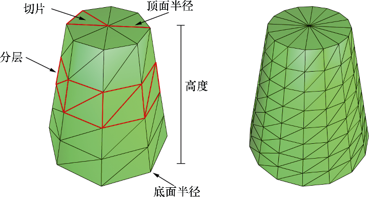

# 绘制几何体

## 帧资源

我们在每帧中都会调用 `flushCommandQueue` 函数, 确保 `GPU ` 能完成所有的命令执行. 但是却效率低下:

1.   每帧的起始阶段 `GPU` 不会执行任何的命令. 因为命令队列里面没有命令
2.   在帧结束的时候, `CPU` 要等待 `GPU` 完成命令的处理

所有 CPU 和 GPU 都有各自的空闲时间, 所有引起低效

**解决方案**

以 GPU 每帧都需要更新得资源作为基本元素, 创建一个环形数组.  我们称这些资源为帧资源, 环形数组通常是又 3 个帧资源构成的

在处理第 n 帧的时候, CPU 从资源数组中取下一个可用的帧资源, 趁着 GPU 还没处理第 n 帧时, CPU 将为第 n 帧更新资源. 此时 CPU 可以提前准备好 n+1 和 n+2 帧.

## 帧资源类

```cc
struct FrameResource {
    FrameResource(ID3D12Device *device, UINT passCount, UINT objectCount);
    ~FrameResource() = default;
public:
    ComPtr<ID3D12CommandAllocator>				cmdListAlloc_ = nullptr;
    unique_ptr<UploadBuffer<PassConstants>> 	passCB_ = nullptr;
    unique_ptr<UploadBuffer<ObjectConstants>> 	objectCB_ = nullptr;
};

FrameResource::FrameResource(ID3D12Device *device, UINT passCount, UINT objectCount) {
 	ThrowIfFailed(device->CreateCommandAllocator(
    	D3D12_COMMAND_LIST_TYPE_DIRECT,
        IID_PPV_ARGS(&cmdListAlloc_)
    ));
	passCB_ = make_unique<UploadBuffer<PassConstants>>(device, passCount, true);
    objectCB_ = make_unique<UploadBuffer<ObjectConstants>>(device, objectCount, true);
}
```

**使用示例**

在 BOX 程序中使用 `FrameResource` 绘制

```cc
constexpr int kNumFrameResources = 3;
vector<unique_ptr<FrameResource>> frameResources_;
FrameResource *currFrameResource_ = nullptr;

// 构建帧资源
void buildFrameResources() {
 	for (int i = 0; i < kNumFrameResource; ++i) {
		// 这里的 n 为绘制的数量 RenderItem 
        frameResources_.empty_back(make_unkque<FrameResource>(d3dDevice_.Get(), 1, n))  ; 
    }
}

int currFrameResourceIndex_ = 0;		// 当前处理的帧下标
void update(float dt) {
 	currFrameResourceIndex = (currFrameResourceIndex + 1) % kNumFrameResources;
	currFrameResource_ = frameResources_[currFrameResourceIndex].get();
    
    // 如果 GPU 没有执行完毕就等待
    auto currGPUFence = commandQueue_->GetLastCompleteFence();	
    if (currFrameResource_->Fence != 0 && urrFrameResource_->Fence < currGPUFence) {
     	HANDLE eventHandle = CreateEventEx(nullptr, false, false, EVENT_ALL_ACCESS);
        ThrowIfFailed(commandQueue_->SetEventOnFenceCompletion(
            currFrameResource_->Fence, eventHandle
        ));
		WaitForSingleObject(eventHandle, INFINITE);
        CloseHandle(eventHandle);
    }
    
    // 更新 currFrameResource 的资源...
}

void draw(float dt) {
 	// 提交 currFrameResource_ 本帧的命令
    currFrameResource_->Fence = ++currentFence_;
    // 创建一个围栏点命令
    commandQueue_->Signal(fence_.Get(), currentFence_);
}
```

## 渲染项

渲染项是一个轻量级的结构体, 存储绘制物体所需要的数据

```cc
struct RenderItem {
  	RenderItem() = default;
public:
    XMFLOAT4X4	world;			    		// 世界矩阵
    int numFrameDirty = kNumFrameResources;	// 脏标记
    UINT objCBIndex = -1;					// 指向GPU常量缓冲区对于对于当前渲染项里面的常量缓冲区
    MeshGeometry *geo = nullptr;			// 几何体, 存在多个渲染项拥有相同的几何体
    // 绘制图元
    D3D12_PRIMITIVE_TOPOLOGY primitiveType = D3D12_PRIMITIVE_TOPOLOGY_TRIANGLELISTS;
    // DrawIndexedInstanced 方法需要的参数
    UINT indexCount = 0;
    UINT startIndexLocation = 0;
    int baseVertexLocation = 0;
};
```

**使用渲染项**

我们可以将渲染项划分为不同的向量里面. 根据不同的 PSO 划分

```cc
vector<unique_ptr<RenderItem>> allRenderItems;	// 保存所有的渲染项
vector<RenderItem *> opaqueRenderItems;			// 不透明的
vector<RenderItem *> transparentRenderItems;	// 透明的
```

## 渲染过程的常量数据

在前面中我们定义了 `PassConstants` 结构体. 

对于 `hlsl` 中的常量缓冲区如下

```hlsl
cbuffer cbPass : register(b1) {
	float4x4 	gViwe;
	float4x4	gInvView;
	float4x4 	gProj;
	float4x4 	gInvProj;
	float4x4	gViewProj;
	float4x4 	gInvViewProj;
	float3 		gEyePos;
	float		cbPerObjectPad1;
	float2		gRenderTargetSize;
	float2 		gInvRenderTargetSize;
	float 		gNearZ;
	float 		gFarZ;
	float 		gTotalTime;
	float 		gDeltaTime;
};		// C++ 中有与之对应的结构体
```

## 每帧更新常量数据

更新几何世界常量 `ObjectConstants`

```cc
void updateObjectCBs(const GameTimer &gt) {
    auto currObjectCB = currFrameResource_->objectCB_.get();
    for (auto &e : allRenderTimes_) {
        if (e->numFrameDirty > 0) {
            XMMATRIX world = XMLoadFloat4x4(&e->world);
            ObjectConstants objConstants;
            XMStoreFloat4x4(&objConstants.world, XMMatrixTranspose(world));
            currObjectCB_->CopyData(e->ObjCBIndex, objConstants);
            --e->numFrameDirty;
        }
    }
}
```

更新通用渲染数据

```cc
void updateMainPaseCB(const GameTimer &gt) {
    XMMATRIX view = XMLoadFloat4x4(&view_);
    XMMATRIX proj = XMloadFloat4x4(&proj_);
    
    XMMATRIX viewProj = XMMatrixMultiply(view, proj);
    XMMATRIX invView = XMMatrixTranspose(&XMMatrixDeterminat(view), view);
    XMMATRIX invViewProj 
        = XMMatrixTranspose(&XMMatrixDeterminat(viewProj), viewProj);
    PassConstants passCB;
    XMStoreFloat4x4(&passCB.view, XMMatrixTranspose(view));
    XMStoreFloat4x4(&passCB.invView, XMMatrixTranspose(invView));
    XMStoreFloat4x4(&passCB.viewProj, XMMatrixTranspose(viewProj));
    XMStoreFloat4x4(&passCB.invViewProj, XMMatrixTranspose(invViewProj));
    passCB.eyePos = eyePos;
    passCB.renderTargetrSize = XMFLOAT2(clientWidth, clientHeight);
    passCB.invRenderTargetSize = 1.0 / passCB.renderTargetSize;
    passCB.nearZ = 1.0;
    passCB.farZ = 1000.0;
    passCB.totalTime = gt.totalTime();
    passCB.deltaTime = gt.deltaTime();
    
    auto currPassCB = currFrameResource_->passCB.get();
    currPassCB->copyData(0, passCB);
}
```

## 不同形状的几何体

定义一个 `generator` 类. 生成几何体

```cc
class GeometryGenerator {
public:
    using uint16 = std::uint16_t;
    using uint32 = std::uint32_t;
    
    struct Vertex {
		XMFLOAT3 	position;
        XMFLOAT3 	normal;
        XMFLOAT3 	tangent;
        XMFLOAT3 	texcoord;
    }
    
    struct MeshData {
      	vector<Vertex>	vertices;
        vector<uint32>	indices;
    };
};
```

## 生成柱体网格




生成步骤:

* 生成侧边的网格
* 生成顶部的网格
* 生成底部的网格

三个不同区域的顶点是重复的, 因为纹理坐标和法线的不相同. 所以存在重复顶点

```cc

MeshData generateCylinker(
	float bottomRadius,		// 顶部圆的半径 
    float topRadius,		// 顶部圆的半径
    float height,			// 高度
    size_t ringCount,		// 圆有多个切片
    size_t stackCount		// 圆柱分层数量
) 
{
    // 侧边的网格顶点
 	vector<Vertex> vertices;
    size_t ringVertexCount = ringCount + 1;
    float bottomHeight = -0.5 * height;
    float topHeight    = +0.5 * height;
    float heightStep   = height / stackCount;
    float radianDelta  = XM_2PI / ringVertexCount;
    for (size_t i = 0; i < stackCount+1; ++i) {
        float radio = float(i) / float(stackCount);
        float y = lerp(bottomHeight, topHeight, radio);
		float radius = lerp(bottomRadius, topRadius, radio);
        for (size_t j = 0; j < ringVertexCount; ++j) {
            float radian = j * radianDelta;
            float x = cos(radian) * radius;
            float z = sin(radian) * radius;
            Vertex v;
            float u = j / ringVertexCount-1;
            float v = radio;
            v.position = XMFLOAT3(x, y, z);
            v.texcoord = XMFLOAT2(u, v);
            vertices.push_back(v);
        }
    }
    // 侧边网格的索引
    vector<uint32> indices;
    for (size_t i = 0; i < stackCount; ++i) {
        for (size_t j = 0; j < ringCount; ++j) {
            indices.push_back((i+0) * ringVertexCount + j+0);
            indices.push_back((i+1) * ringVertexCount + j+0);
            indices.push_back((i+1) * ringVertexCount + j+1);
            
			indices.push_back((i+0) * ringVertexCount + j+0);
            indices.push_back((i+1) * ringVertexCount + j+1);
            indices.push_back((i+0) * ringVertexCount + j+0);
        }
    }
    
    // 生成顶部网格
    for (size_t i = 0; i < ringVertexCount; ++i) {
        float radian = i * radianDelta;
        float x = cos(radian) * topRadius;
        float y = topHeight;
        float z = sin(radian) * topRadius;
        float u = float(i) / ringCount;
        float v = 0;
        Vertex v;
        v.position = XMFLOAT3(x, y, z);
        v.texcoord = XMFLOAT2(u, v);
        vertices.push_back(v);
    }
    Vertex topCenter;
    topCenter.position = XMFLOAT(0, topHeight, 0);
    
    v.push_back()
}
```


