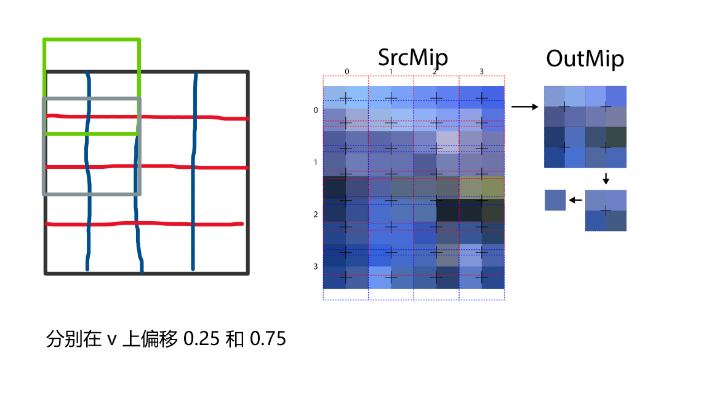

# 计算着色器

## 线程与线程组

在GPU编程的过程中，根据程序具体的执行需求，可将线程划分为由线程组构成的网格

每个线程组中都有一块共享内存, 供组内的线程访问. 

* 线程并不能访问其他组中的共享内存
* 同组内的线程间能够进行同步操作

注意:

> 一个线程组中含有[插图]个线程。硬件实际上会将这些线程分为多个warp(每个warp中有32个线程)
>
> 在Direct3D中，我们能够以非32的倍数值来指定线程组的大小。但是出于性能的原因，我们应当总是将线程组的大小设置为warp尺寸的整数倍

**启用线程组**

```cc
void ID3D12GraphicsCommandList::Dispatch(
	UINT ThreadGroupCountX,
    UINT ThreadGroupCountY,
    UINT ThreadGroupCountZ
);
```

**例子: 分派一个 3x2 的线程组**

```cc
pCmdList->Dispatch(3, 2, 1);
```


***

## 简单的计算着色器

将两个纹理累计的计算着色器示例

```cc
cbuffer cbSettings : register(b0) {
  	// 计算着色器访问的产量缓冲区  
};

Texture2D gInputA : register(t0);
texture2D gInputB : register(t1); 
RWTexture2D<float4> gOuput : register(u0);

// 每个线程组的线程数量, (X, Y, Z) 三个维度的线程数
[numthreads(16, 16, 1)]
void CS(int3 dispatchThreadID : SV_DispatchThreadID) {	// 线程ID
	gOutput[dispatchThreadID.xy] = 
        gInputA[dispatchThreadID.xy] + 
        gInputB[dispatchThreadID.]
}
```

一个计算着色器由下列要素

* 通过常量缓冲区访问的全局变量
* 输入与输出资源
* `[numthreads(X, Y, Z)]` 属性，指定3D线程网格中的线程数量
* 每个线程都要执行的着色器指令
* 线程ID系统值参数

***

## 计算流水线状态对象

为了构建计算着色器的 PSO, 我们需要填写下列结构体

```cc
typedef struct D3D12_COMPUTE_PIPELINE_STATE_DESC {
  ID3D12RootSignature         *pRootSignature;		// 根签名
  D3D12_SHADER_BYTECODE       CS;					// 计算着色器
  UINT                        NodeMask;				// 设备ID
  D3D12_CACHED_PIPELINE_STATE CachedPSO;			
  D3D12_PIPELINE_STATE_FLAGS  Flags;				// 标志位
} D3D12_COMPUTE_PIPELINE_STATE_DESC;
```

使用下面的接口构建 PSO

```cc
HRESULT ID3D12GraphicsCommandList::CreateComputePipelineState(
	const D3D12_COMPUTE_PIPELINE_STATE_DESC *pDesc,
    REFIID                                  riid,
  	void                                    **ppPipelineState
);
```

***

## 数据的输入

前面我们定义了两个**只读的着色器输入**

```cc
Texture2D gInputA : register(t0);
Texture2D gInputB : register(t1);
```

通过给输入纹理 `gInputA` 与 `gInputB` 分别创建 `SRV`, 再将它们作为参数传入根参数, 我们就能令这两个纹理都绑定为着色器的输入资源

```cc
pCmdList->SetComputeRootDescriptorTable(1, srvA);
pCmdList->SetComputeRootDescriptorTable(2, srvB);
```

***

## 纹理输出与无序访问视图

在前一节的计算着色器代码中，我们定义了一个输出资源

**计算着色器处理输出资源的方式比较特殊，它们的类型还有一个特别的前缀“RW”，意为读与写**, 用尖括号模板语法, 指定输出的类型

```cc
RWTexture2D<float4> gOuput : register(u0);
```

为了绑定在计算着色器中要执行写操作的资源，我们需要将其与称为**无序访问视图**

创建 UAV 视图, 需要填写 `D3D12_UNORDERED_ACCESS_VIEW_DESC` 结构体

```cc
void CreateUnorderedAccessView(
 	ID3D12Resource                         *pResource,		
 	ID3D12Resource                         *pCounterResource,
 	const D3D12_UNORDERED_ACCESS_VIEW_DESC *pDesc,
 	D3D12_CPU_DESCRIPTOR_HANDLE            DestDescriptor
);
```

纹理资源创建UAV的示例

```cc
// 创建资源
D3D12_RESOURCE_DESC texDesc;
memset(&texDesc, 0, sizeof(texDesc));
texDesc.Dimension = D3D12_RESOURCE_DIMENSION_TEXTURE_2D;
texDesc.Alignment = 0;
texDesc.Width = mWidth;
texDesc.Height = mHeight;
texDesc.DepthOrArraySize = 1;
texDesc.MipLevles = 1;
texDesc.Format = DXGI_FROMAT_R8G8B8A8_UNORM;
texDesc.SamplerDesc.Count = 1;
texDesc.SamplerDesc.Quality = 0;
texDesc.Layout = D3D12_TREXTURE_LAYOUT_UNKNOW;
// 资源必须使用 D3D12_RESOURCE_FLAG_ALLOW_UNORDERED_ACCESS 创建
texDesc.Flags = D3D12_RESOURCE_FLAG_ALLOW_UNORDERED_ACCESS;	
ThrowIfFailed(pDevice->CreateCommitedResource(
	RVPtr(CD3DX12_HEAP_PROPERTIES(D3D12_HEAP_TYPE_DEFAULT)),
    D3D12_HEAP_FLAG_NONE,
    &texDesc,
    D3D12_RESOURCE_STATE_COMMON,
    nullptr,
    IID_PPV_ARGS(&mBlurMap0)
));

// 创建 SRV 视图
D3D12_SHADER_RESOURCE_VIEW_DESC srvDesc = {};
srvDesc.Shader4ComponentMapping = D3D12_DEFAULT_SHADER_4_COMPONENT_MAPPING;
srvDesc.Format = mFormat;
srvDesc.ViewDimension = D3D12_SRV_DIMENSION_TEXTURE2D;
srvDesc.Texture2D.MostDetailedMip = 0;
srvDesc.Texture2D.MipLevels = 1;
pDevice->createShaderResourceView(mBlurMap0.Get(), 
	&srvDesc,
	blurOCpuSrv
);

// 创建 UAV 视图
D3D12_UNORDERED_ACCESS_VIEW_DESC uavDesc = {};
uavDesc.Format = mFormat;
uavDesc.ViewDimension = D3D12_UAV_DIMENSION_TEXTURE2D;
uavDesc.Texture2D.MipSlice = 0;
pDevice->C(mBlurMap0.Get(), 
	&uavDesc,
	blurOCpuUav
);
```

***

## 利用索引对纹理进行采样

纹理元素可以借助2D索引加以访问。计算着色器中，我们基于分派的线程ID来索引纹理; 而每个线程都要被指定一个唯一的调度ID

```cc
[numthread(16, 16, 1)]
void GS(int3 dispatchThreadID : SV_DispatchThreadID) {
    gOutput[dispatchThreadID.xy] = 		
        gInputA[dispatchThreadID.xy] +
        gInputB[dispatchThreadID.xy];
}
```

注意:

> 系统对计算着色器中的索引越界行为有着明确的定义。越界的读操作总是返回0，而向越界处写入数据时却不会实际执行任何操作

由于计算着色器运行在GPU上，因此便可以将它作为访问GPU的一般工具，特别是在通过纹理过滤来对纹理进行采样的时候. 我们不能使用Sample方法，而必须采用 `SampleLevel `方法(第三个参数是 mipmap )

采样纹理时, 需要使用 $[-1, +1]$ 归一化都得坐标, 而不是整数索引
$$
u = \frac{x}{width}\\
v = \frac{y}{height}
$$
采样例子: 使用整数索引采样

```cc
cbuffer cbUpdateSettings : register(b0) {
    float2 gWaveConstant0;
    float2 gWaveConstant1;
    float2 gWaveconstant2;
    float2 gDisturbMag;
    int2   gDisturbIndex;
};

RWTexture2D gPrevSolInput : register(u0);
RWTexture2D gCurrSolInput : register(u1);
RWTexture2D gOutput 	  : register(u2);

// 使用整数索引访问, 不能访问其他 mipmap 
[numthreads(16, 16, 1)]
void CS0(int3 dispatchThreadID : SV_DispatchThreadID) {
    int x = dispatchThreadID.x;
    int y = dispatchThreadID.y;
    gOutput[intx(x, y)] = 
        gWaveConstant0 * gPrevSolInput[int2(x, y)].r +
        gWaveConstant1 * gCurrSolInput[int2(x, y)].r +
        gWaveconstant2 * (
        	gPrevSolInput[int2(x, y+1)].r +
            gPrevSolInput[int2(x, y-1)].r +
        	gPrevSolInput[int2(x+1, y)].r +
        	gPrevSolInput[int2(x-1, y)].r
        );
}

// 使用 SampleLevel 访问, 可以使用过滤方式
void CS0(int3 dispatchThreadID : SV_DispatchThreadID) {
    int x = dispatchThreadID.x;
    int y = dispatchThreadID.y;
    float2 c = float2(x, y) / 512.0;   
    float2 t = float2(x, y-1) / 512.0;
    float2 b = float2(x, y+1) / 512.0;
    float2 l = float2(x-1, y) / 512.0;
    float2 r = float2(x+1, y) / 512.0;
    gOutput[int2(x, y)] = 
		gWaveConstant0 * gPrevSolInput.SampleLevel(samPoint, c, 0.0).r +
        gWaveConstant1 * gCurrSolInput.SampleLevel(samPoint, c, 0.0).r +
		gWaveconstant2 * (
        	gPrevSolInput.SampleLevel(samPoint, b, 0.0).r +
            gPrevSolInput.SampleLevel(samPoint, t, 0.0).r +
        	gPrevSolInput.SampleLevel(samPoint, r, 0.0).r +
        	gPrevSolInput.SampleLevel(samPoint, l, 0.0).r
        );
}
```

***

## 结构化缓冲区资源

结构化缓冲区是一种由相同类型元素所构成的简单缓冲区其本质上是一种数组。正如我们所看到的，该元素类型可以是用户以 `HLSL` 定义的结构体

```cc
struct Data {
    float3 v1;
    float2 v2;
};

StructedBuffer<Data> gInputA  : register(t0);
StructedBuffer<Data> gInputB  : register(t1);
RWStructedBuffer<Data> gOuput : register(u0);
```

**绑定结构化缓冲区**

顶点缓冲区与索引缓冲区创建SRV的方法同样用于创建结构化缓冲区的SRV.

但是必须指定 `D3D12_RESOURCE_FLAG_ALLOW_UNORDERED_ACCESS`

```cc
struct Data {
    float3 v1;
    float2 v2;
};

// 准备好数据
std::vector<Data> dataA(numDataElements);
std::vector<Data> dataB(numDataElements);
for (std::size_t i = 0; i < numDataElements; ++i) {
    dataA[i].v1 = XMFLOAT3(i, i, i);
    dataA[i].v2 = XMFLOAT2(i, 0);
    dataB[i].v1 = XMFLOAT3(-i, i, 0);
    dataB[i].v2 = XMFLOAT2(0, -i);
}

UINT64 byteSize = numDataElements * sizeof(Data);

// 作为结构化缓冲区输入A, 设置根描述符或者根描述表的方式绑定都着色器上
mInputBufferA = CreateDefaultBuffer(
	pDevice.Get(),
    pCmdList.Get(),
    dataA.data(),
    byteSize,
    mInputUploadBufferA
);
 
// 作为结构化缓冲区输入B. 设置根描述符或者根描述表的方式绑定都着色器上
mInputBufferB = CreateDefaultBuffer(
	pDevice.Get(),
    pCmdList.Get(),
    dataA.data(),
    byteSize,
    mInputUploadBufferB
);

// 创建好资源以后, 创建 UAV, 就可以绑定到流水线中
ThrowIfFailed(pDevice->CreateCommitedResource(
	RVPtr(CD3DX12_HEAP_PROPERTIES(D3D12_HEAP_TYPE_DEFAULT)),
    D3D12_HEAP_FLAG_NONE,
    RVPtr(CD3DX12_RESOURCE_DESC::Buffer(
        byteSize, 
        D3D12_RESOURCE_FLAG_ALLOW_UNORDERED_ACCESS	// 使用无序访问标记
    )),
    D3D12_RESOURCE_STATE_UNORDERED_ACCESS,
    nullptr,
    IID_PPV_ARGS(&mOutputBuffer)
));
```

***

## 回读缓冲资源

使用步骤如下

* 创建一个内存缓冲区
* 将默认缓冲区将数据拷贝到内存缓冲区
* 等待命令完成
* 使用 map 映射获得数据地址

使用实例:

``` cc
// 创建一个内存缓冲区
ThrowIfFailed(pDevice->CreateCommitedResource(
	&CD3DX12_HEAP_PROPERTIES(D3D12_HEAP_TYPE_READBACK),
    D3D12_HEAP_FALG_NONE,
    &CD3DX12_RESOURCE_DESC::Buffer(sizeByte),
    D3D12_RESOURCE_S TATE_COPY_DEST,
    nullptr,
    IID_PPV_ARGS(&pReadBackbuffer)
));

// 将默认缓冲区将数据拷贝到内存缓冲区
pCmdList->ResourceBarrier(1, &CD3DX12_RESOURCE_BARRIER::Transition(
	pOutputBuffer.Get(),
    D3D12_RESOURCE_STATE_COMMON,
    D3D12_RESOURCE_STATE_COPY_SOURCE
));

pCmdList->CopyResource(pReadBackbuffer.Get(), pOutputBuffer.Get());

pCmdList->ResourceBarrier(1, &CD3DX12_RESOURCE_BARRIER::Transition(
	pOutputBuffer.Get(),
    D3D12_RESOURCE_STATE_COPY_SOURCE,
    D3D12_RESOURCE_STATE_COMMON
));

// 等待命令完成
ThrowIfFailed(pCmdList->Close());
D3D12CommandList *cmdsLists[] = { pCmdList.Get() };
pCmdQueue->ExecuteCommandLists(1, cmdsLists);

fluseCommandQueue();

// 使用 map 映射获得数据地址
Data *pMeppedData = nullptr;
ThrowIfFailed(pReadBackbuffer->Map(0, nullptr, (void **)&pMeppedData)));

// 使用 pMeppedData 访问数据
```

***

## 线程标识的系统值


考虑图中标出的线程，其所在线程组的ID是 (1, 1, 0)，它在组中的线程ID为(2, 5, 0)。

因此，该线程的调度线程ID为
$$
(1, 1, 0) \times (8, 8, 0) + (2, 5, 0) = (10, 13, 0)
$$
而它在组中的线程ID则为
$$
5 \times 8 + 2
$$

***

**线程组ID**

系统会为每个线程组都分配一个ID，这个ID称为线程组ID, 其系统值的语义为 `SV_GroupID`

如果分配 $(G_x, G_y, G_z)$ 个线程组, 那么组ID的范围为 `(0, 0, 0)` 到 `(gx-1, gy-1, gz-1)`

***

**组内线程ID**

在线程组中，每个线程都被指定了一个组内的唯一ID, 若线程组的规模为 `(X, Y, Z)`, 

则组内线程ID的范围为 `(0, 0, 0)` 到 `(X-1, Y-1, Z-1)`. 组内线程ID系统值的语义为 `SV_GroupThreadID`

***

**计算调度线程ID**

带入前面的公式, 就能计算出来. 调度线程ID的系统值语义为 `SV_DispatchThreadID`

```cc
dispatchThreadID.xyz = groupID.xyz * ThreadGroupSize.xyz + groupThreadID.xyz;
```

***

**线性索引**

通过Direct3D的系统值 `SV_GroupIndex` 便可以指定组内线程ID的线性索引，它的换算方法为

```cc
groupIndex = groupThreadID.z * (ThreadGroupSize.x * ThreadGroupSize.y) +
    		 groupThreadID.y * ThreadGroupSize.x +
             groupThreadID.x;
```

注意:

> 使用索引访问数据是, 是以这样的方式访问的 `int3(x, y, z)`. 对应前面的图来说, **先访问行, 然后访问列, 最后访问片**

***

## 追加缓冲区与消费缓冲区

追加缓冲区与消费缓冲区, 可以让我们以任意的顺序处理. 想象成一个队列. 线程先后从队列获取数据处理

**创建结构化缓冲区, 将数据绑定到 GPU 上**

```cc
struct Particle {
  	float3 position;
    float3 velocity;
    float3 accleration;
};

float timeStep = 1.0 / 60.f;
ConsumStructuredBuffer<Particle> gInput;
AppendStructuredBuffer<Particle> gOutput;

[numthreads(16, 16, 1)]
void CS() {
    // 获取数据
    Particle p = gInput.Consume();			
    // 处理数据
    p.velocity += p.accleration * timeStep;
    p.position += p.velocity * timeStep;
    // 输出
    gOutput.Append(p);
}
```

***

## 共享内存与线程同步

每个线程组都有一块称为共享内存或线程本地存储器的内存空间。这种内存的访问速度很快，可认为与硬件高速缓存的速度不相上下。在我们的计算着色器的代码中，共享内存的声明如下

```cc
groupshared float4 gCache[256];
```

数组大小可依用户的需求而定,但是线程组共享内存的上限为 `32 kb`. 由于共享内存是线程组里的本地内存,所以要通过`SV_GroupThreadID` 语义对它进行索引

我们可以先让线程从纹理中读取数据到高速缓存, 随后在算法中, 只需要读取高速缓冲中的数据, 进行模糊操作就好

**有一个问题随之而来，根源在于我们无法保证线程组内的所有线程都能同时完成任务。这可能会导致线程访问到还未经初始化的共享内存元素，因为负责将这些元素进行初始化的相邻线程也许还没有完成它的本职工作**

**同步命令**

```cc
Texture2D 		  gInput;
RWTexture<float4> gOutput;
groupshadred float4 gCache[256];

[numthreads(256, 1, 1)]
void CS(int3 groupThreadID : SV_GroupThreadID,
        int3 dispatchThreadID : SV_DispatchThreadID)
{
	gCache[groupThreadID.x] = gInput[dispatchThreadID.xy];
    
    // fence 同步组内所有线程
    GroupMemoryBarrierWithGroupSync();
    
    // 安全访问 gChche[256]
}
```


## 生成 Mipmap

生成 mipmap 是计算一个大小为原始图像一半的图像的过程。重复该过程，直到生成 1×1 图像

### 非 2 的幂

当被 mipmap 的图像不是 2 的幂时，必须小心. mipmap 必须在 2 的幂大小的纹理上工作. 2的幂大小的纹理可以一直减半到 1x1 尺寸, 而不会发生奇数的宽高

但是生成 mipmap 时, 不一定要严格要求纹理是2的幂, 所以代码必须考虑到这种情况


例如一个 5x5 大小的纹理,缩小到 2.5x2.5, 像素中不可能有 0.5 个像素, 所以必须将 0.5 丢弃

### 生成 mipmap 的 compute shader 代码

生成 mipmap 有四种情况需要处理:

1. 源图宽高都是偶数
2. 源图宽度是奇数, 高度是偶数
3. 原图宽度是偶数, 高度是奇数
4. 原图宽度和高度都是奇数

#### 源图宽高都是偶数


每个线程计算出来的纹理坐标都是在 p 处(像素的中心), 为了使用 **linear** 采样, 我们需要偏移到 p' 处, 让硬件帮助我们采样四个像素

```cc
float2 uv = InvTexSize * (csin.DispatchThreadID.xy + 0.5);		// 加上 0.5 半个像素
float4 src = gSrcMip.SampleLevel(gSamLinearClamp, uv, SrcMipLevel);
```

#### 源图宽度是奇数, 高度是偶数

当宽度是奇数时, 在 u 上需要更多的样本, 分别**采集绿色样本和灰色样本**


```cc
float2 uv0 = InvTexSize * (csin.DispatchThreadID.xy + float2(0.25, 0.5));
float2 uv1 = uv0 + (InvTexSize * float2(0.5, 0.0));
float4 src  = 0.5 * gSrcMip.SampleLevel(gSamLinearClamp, uv0, SrcMipLevel);
       src += 0.5 * gSrcMip.SampleLevel(gSamLinearClamp, uv1, SrcMipLevel);
```

#### 源图宽度是偶数, 高度是奇数

当高度是是奇数时, 在 v 上需要更多的样本, 分别**采集绿色样本和灰色样本**




```cc
float2 uv0 = InvTexSize * (csin.DispatchThreadID.xy + float2(0.5, 0.25));
float2 uv1 = uv0 + InvTexSize * float2(0.0, 0.5);
float4 src  = 0.5 * gSrcMip.SampleLevel(gSamLinearClamp, uv0, SrcMipLevel);
	   src += 0.5 * gSrcMip.SampleLevel(gSamLinearClamp, uv1, SrcMipLevel);
```


#### 源图宽高都是奇数

需要在 u, v 上都需要更多的样本


```cc
float2 uv0 = InvTexSize * (csin.DispatchThreadID.xy + float2(0.25, 0.25));
float2 uv1 = InvTexSize * (csin.DispatchThreadID.xy + float2(0.75, 0.25));
float2 uv2 = InvTexSize * (csin.DispatchThreadID.xy + float2(0.25, 0.75));
float2 uv3 = InvTexSize * (csin.DispatchThreadID.xy + float2(0.75, 0.75));
float4 src  = 0.25 * gSrcMip.SampleLevel(gSamLinearClamp, uv0, SrcMipLevel);
	   src += 0.25 * gSrcMip.SampleLevel(gSamLinearClamp, uv1, SrcMipLevel);
	   src += 0.25 * gSrcMip.SampleLevel(gSamLinearClamp, uv2, SrcMipLevel);
	   src += 0.25 * gSrcMip.SampleLevel(gSamLinearClamp, uv3, SrcMipLevel);
```


#### 写入1层mipmap上

```cc
OutMip1[csin.DispatchThreadID.xy] = PackColor( Src1 );
```

#### 计算第2层Mipmap

对于第一层 mipmap 的写入, 只有组内线程ID, xy都是偶数时, 才会进行写入


```cc
// 检查 x, y 都是偶数时, 那么进行计算 1 层Mipmap
if ((csin.GroupIndex & 0x9) == 0) {
    float4 src2 = LoadColor(csin.GroupIndex + 1);	// 右边
    float4 src3 = LoadColor(csin.GroupIndex + 8);	// 下面
    float4 src4 = LoadColor(csin.GroupIndex + 9);	// 右下
    src1 = (src1 + src2 + src3 + src4)  * 0.25;
    OutMip2[csin.DispatchThreadID.xy / 2] = PackColor(src1);
    StoreColor(csin.GroupIndex, src1);		// 写到 groupshared 内存中 
}
```

#### 计算第3层mipmap

对于第二层 mipmap 时, 只有 GroupIndex 的后 2 位为 00 时才会写入


```cc
if ((csin.GroupIndex & 0x1B) == 0) {
    // 拿到上一层计算好的结果
   float4 src2 = LoadColor(csin.GroupIndex + 4);	// 下面
    float4 src3 = LoadColor(csin.GroupIndex + 32);	// 下面
    float4 src4 = LoadColor(csin.GroupIndex + 36);	// 右下
    src1 = (src1 + src2 + src3 + src4)  * 0.25;
    OutMip3[csin.DispatchThreadID.xy / 4] = PackColor(src1);
	StoreColor(csin.GroupIndex, src1);		// 写到 groupshared 内存中 
}
```

***

#### 计算第4层mipmap

最后一层是最简单的, 只有第一个需要计算, 也是读取第二层计算好的结果, 直接评价


```cc
if (csin.GroupIndex == 0) {
	float4 src2 = LoadColor(csin.GroupIndex + 4);			// 右边
	float4 src3 = LoadColor(csin.GroupIndex + (4 * 8));		// 下面
    float4 src3 = LoadColor(csin.GroupIndex + (4 * 8 + 4));	// 右下
    src1 = (src1 + src2 + src3 + src4)  * 0.25;
    OutMip3[csin.DispatchThreadID.xy / 8] = PackColor(src1);
}
```

***

#### 完整的代码:

```cc
#define BLOCK_SIZE 8			// 线程组当维度的线程数量
#define GROUP_THREAD_SIZE (BLOCK_SIZE * BLOCK_SIZE)
// 以下的宏根据源mip的情况, 使用不同的代码
#define WIDTH_HEIGHT_EVEN 0     // 纹理宽高都是偶数
#define WIDTH_ODD_HEIGHT_EVEN 1 // 纹理宽度是奇数，高度是偶数
#define WIDTH_EVEN_HEIGHT_ODD 2 // 纹理宽度是偶数，高度是奇数
#define WIDTH_HEIGHT_ODD 3      // 纹理的宽度和高度都是奇数的  


struct CSIn {
    uint3 	GroupID 		  : SV_GroupID;				// 线程组 ID
    uint32  GroupThreadID	  : SV_GroupThreadID;		// 组内线程 ID
    uint32  DispatchThreadID  : SV_ThreadDispatchID;	// 线程 ID
    uint  	GroupIndex        : SV_GroupIndex;			// 线程组内索引
};

cbuffer CBGenerateMips : register(b0) {
  	uint   SrcMipLevel;		// 源 mipmap 等级
    uint   NumMipLevels;	// 输出的 mipmap 数量 [1-4]
    uint   SrcDimension;	// 源 mipmap 的情况
    bool   IsSRGB;			// 是否是 SRGB
    float2 InvTexSize; 		// 纹理的大小. 1.f / texSize;
};

Texture2D<float4>   gSrcMip     : register(t0);		
RWTexture2D<float4> gOutMip1    : register(u0);		
RWTexture2D<float4> gOutMip2    : register(u1);		
RWTexture2D<float4> gOutMip3    : register(u2);
RWTexture2D<float4> gOutMip4    : register(u3);
SamplerState LinearClampSampler : register(s0);

// 将 rgba 分离 减少冲突
groupshared float gSR[GROUP_THREAD_SIZE];
groupshared float gSG[GROUP_THREAD_SIZE];
groupshared float gSB[GROUP_THREAD_SIZE];
groupshared float gSA[GROUP_THREAD_SIZE];

void StoreColor(uint index, float4 color) {
    gSR[index] = color.r;
    gSG[index] = color.g;
    gSB[index] = color.b;
    gSA[index] = color.a;
}

float4 LoadColor(uint index) {
    return float4(gSR[index], gSG[index], gSB[index], gSA[index]);
}

// 转换为线性空间: https://en.wikipedia.org/wiki/SRGB#The_reverse_transformation
float3 ConvertToLinear(float3 x) {
    return x < 0.04045f ? x / 12.92 : pow((x + 0.055) / 1.055, 2.4);
}

// 转换为 SRGB 空间: https://en.wikipedia.org/wiki/SRGB#The_forward_transformation_(CIE_XYZ_to_sRGB)
float3 ConvertToSRGB( float3 x ) {
    return x < 0.0031308 ? 12.92 * x : 1.055 * pow(abs(x), 1.0 / 2.4) - 0.055;
}

float4 PackColor(float4 x) {
    if (IsSRGB)
        return float4(ConvertToSRGB(x.rgb), x.a);
	return x;
}

void main(CSIn csin) {
    float src1 = float4(0.f, 0.f, 0.f, 0.f);
    switch (SrcDimension) {
    case WIDTH_HEIGHT_EVEN: {
        float2 uv = InvTexSize * (csin.DispatchThreadID.xy + float2(0.5, 0.5));
        src1 += gSrcMip.SampleLevel(gSamLinearClamp, uv, SrcMipLevel);
        break;
    }
    case WIDTH_ODD_HEIGHT_EVEN: {
        float2 uv0 = InvTexSize * (csin.DispatchThreadID.xy + float2(0.25, 0.5));
        float2 uv1 = InvTexSize * (csin.DIspatchThreadID.xy + float2(0.75, 0.5));
        src1 += 0.5 * gSrcMip.SampleLevel(gSamLinearClamp, uv0, SrcMipLevel);
        src1 += 0.5 * gSrcMip.SampleLevel(gSamLinearClamp, uv1, SrcMipLevel);
        break;
    }
    case WIDTH_EVEN_HEIGHT_ODD: {
		float2 uv0 = InvTexSize * (csin.DispatchThreadID.xy + float2(0.5, 0.25));
        float2 uv1 = InvTexSize * (csin.DIspatchThreadID.xy + float2(0.5, 0.75));
        src1 += 0.5 * gSrcMip.SampleLevel(gSamLinearClamp, uv0, SrcMipLevel);
        src1 += 0.5 * gSrcMip.SampleLevel(gSamLinearClamp, uv1, SrcMipLevel);
        break;
    }
    case WIDTH_HEIGHT_ODD:
        float2 uv0 = InvTexSize * (csin.DispatchThreadID.xy + float2(0.25, 0.25));
        float2 uv1 = InvTexSize * (csin.DIspatchThreadID.xy + float2(0.75, 0.25));
        float2 uv2 = InvTexSize * (csin.DIspatchThreadID.xy + float2(0.25, 0.75));
        float2 uv3 = InvTexSize * (csin.DIspatchThreadID.xy + float2(0.75, 0.75));
		src1 += 0.25 * gSrcMip.SampleLevel(gSamLinearClamp, uv0, SrcMipLevel);
        src1 += 0.25 * gSrcMip.SampleLevel(gSamLinearClamp, uv1, SrcMipLevel);
        src1 += 0.25 * gSrcMip.SampleLevel(gSamLinearClamp, uv2, SrcMipLevel);
        src1 += 0.25 * gSrcMip.SampleLevel(gSamLinearClamp, uv3, SrcMipLevel);
        break;
    }
    
    gOutMip1[csin.DispatchThreadID.xy] = float4(PackColor(src1.rgb), src1.a);
    if (NumMipLevels == 1)
        return;
  
    // 开始计算第二层
    StoreColor(csin.DispatchThreadID.xy, src1);
    GroupMemoryBarrierWithGroupSync();
	if ((csin.GroupIndex & 0x9) == 0) {
        float4 src2 = LoadColor(csin.GroupIndex + 1);
        float4 src3 = LoadColor(csin.GroupIndex + 8);
        float4 src4 = LoadColor(csin.GroupIndex + 9);
		src1 = (src1 + src2 + src3 + src4) * 0.25;
        gOutMip2[csin.DispatchThreadID.xy / 2] = float4(PackColor(src1.rgb), src1.a);
    }
    
    if (NumMipLevels == 2)
        return;
    
    // 开始计算第三层
    StoreColor(csin.DispatchThreadID.xy, src1);
    GroupMemoryBarrierWithGroupSync();
	if ((csin.GroupIndex & 0x1b) == 0) {
        float4 src2 = LoadColor(csin.GroupIndex + 2);
        float4 src3 = LoadColor(csin.GroupIndex + 16);
        float4 src4 = LoadColor(csin.GroupIndex + 18);
		src1 = (src1 + src2 + src3 + src4) * 0.25;
        gOutMip3[csin.DispatchThreadID.xy / 4] = float4(PackColor(src1.rgb), src1.a);
    }
    
    if (NumMipLevels == 3)
        return;
    
    // 开始计算第4层
    StoreColor(csin.DispatchThreadID.xy, src1);
    GroupMemoryBarrierWithGroupSync();
	if (csin.GroupIndex  == 0) {
        float4 src2 = LoadColor(csin.GroupIndex + 4);
        float4 src3 = LoadColor(csin.GroupIndex + 32);
        float4 src4 = LoadColor(csin.GroupIndex + 36);
		src1 = (src1 + src2 + src3 + src4) * 0.25;
        gOutMip4[csin.DispatchThreadID.xy / 4] = float4(PackColor(src1.rgb), src1.a);
    }
}
```

